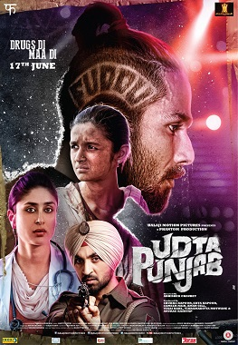
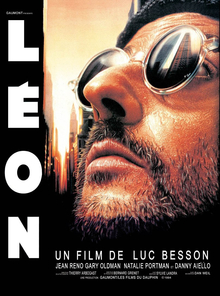

---

This spoiler less review series is part of my journey, to watch as much good cinema as possible in this quarantine. Ranked not in any particular/strict order. There may be some personal bias and objective ranking but we have tried to be as accurate and complete as possible. Enjoy!‍

## 1. Schindler's List (1993 ‧ War/Drama ‧ 3h 17m)
  
This movie depicts a side story during the WW2 Nazi Germany and how one person can make such big impact on the life of not only many people but generations to come. This movie helped me learn how a man should live.

## 2. Udta Punjab (2016 ‧ Crime/Thriller ‧ 2h 29m)
  
This story revolve around 4 people and the drug situation in Punjab, India.

## 3. The Godfather (1972 ‧ Drama/Crime ‧ 2h 58m)
  
Based on a crime novel by American author Mario Puzo. The story revolve around a fictional Mafia family in New York City inspired by real events.

## 4. The Godfather Part II (1974 ‧ Crime/Drama ‧ 3h 22m)
  
The second part where the protagonist's son take over the family business.

## 5. The Departed (2006 ‧ Crime/Thriller ‧ 2h 31m)
  
Loading...

## 6. Fight Club (1999 ‧ Drama/Thriller ‧ 2h 31m)
  
Another thriller based on a novel by Chuck Palahniuk. This movie unveils a thick cloth from the consumerism we have buried under and won't even know.

## 7. The Terminal (2004 ‧ Comedy/Romance ‧ 2h 8m)
  
We're going to see more of Tom Hanks in this list. This movie teaches how situations are people and people can be extraordinary.

## 8. Taxi Driver (1976 ‧ Drama/Crime ‧ 1h 54m)
  
Martin Scorsese has it again, made us live in a dream we don't want to wake up with.

## 9. Dead Poets Society (1989 ‧ Drama/Teen ‧ 2h 20m)
  
This movie motivated me to start reading literature, poems, etc. And I'm still discovering new things on the way!

## 10. Anand (1971 ‧ Drama/Musical ‧ 2h 3m)
  
One of the best film produce under Hindi cinema. 

## 11. The Truman Show (1998 ‧ Drama/Comedy ‧ 1h 47m)
  
How a perfect world would feel? Chaos make people live, otherwise aren't we just dreaming?

## 12. Memento (2000 ‧ Thriller/Mystery ‧ 1h 54m)
  
Twist and burn your brain cells.

## 13. The Shawshank Redemption (1994 ‧ Drama/Crime ‧ 2h 22m)
  
The highest rating movie of all time in IMBD.

## 14. Léon (1994 ‧ Action/Drama ‧ 1h 50m)
  
You can find a different meaning of Love.

## 15. Amélie (2001 ‧ Romance/Rom-com ‧ 2h 9m)
  
Another French entry after leon. Too beautiful for a movie.

## 16. The Wolf of Wall Street (2013 ‧ Comedy/Crime ‧ 3h)
  
_Wall Street, Money, sex and drugs._

## 17. Gangs of Wasseypur (2012 ‧ Crime/Drama ‧ 2h 40m)
  
By this movie Anurag Kashyap changed the Hindi cinema.

## 18. Gangs of Wasseypur - Part 2 (2012 ‧ Crime/Drama ‧ 2h 39m)
  
When reality is better than fiction. This movie is a definition of that.

## 19. Lost in Translation (2003 ‧ Romance/Drama ‧ 1h 44m)
  
The movie does not make sense for most people, but what does anyway?

## 20. Jurassic Park (1993 ‧ Adventure/Sci-fi ‧ 2h 7m)
  
This movie is more than brilliant special effects.

---
### Additional sources

- Suggested song: [Earth, Wind & Fire - September](https://youtu.be/Gs069dndIYk)