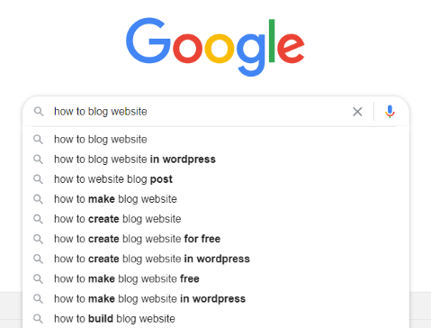
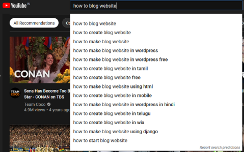
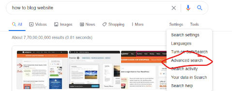
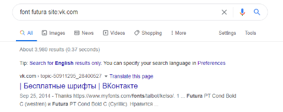
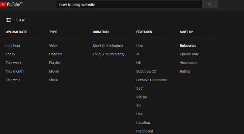
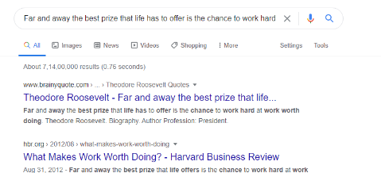
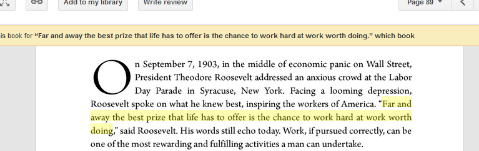

---

From finding information to writing a blog, to learn something new or just to keep up with the trends. Collecting information is all we do in the 21st century and with modern problems, we have to use modern solutions. In this blog post, we will look into some battle-tested techniques to collect data efficiently and find exactly what you’re looking for in the minimum amount of time. This is by no means a complete record of those techniques rather a random collection of my piece of mind and things that work with evidently.

## Guidelines (Boring Stuff)
The procedure used to collect data may vary on many things including your requirement, design needs, orders or instructions, context, issues that need to be monitored, purpose, nature and size of data. The model presented here is offered just a reference tool and should not be considered a single source of truth. So the next time you’re going through data collection you can skim through the below-mentioned points quickly.
1. Identify issues and opportunity.
2. Set Goals.
3. Plan approach and methods.
4. Audience, location and geographical area this data is collected for.
5. Qualitative and Quantitative assignment.
6. Check if somebody already has done this. People are guidelines!
7. Librarian. They know a lot of shit, at least the good ones, yes.

## Let Keyword guide you (Cool Stuff)
Worry not if you don’t know what you’re looking for, this may sound weird but it happens sometimes when you don’t know about that subject at all but only some words related to it. Just search search search! In whatever search engines you come across that suggest while you type like [Google](https://www.google.com/), [Youtube](https://www.youtube.com/), [Twitter](https://www.twitter.com/), [Internet Archive](https://archive.org/), etc. For example, suppose, one day you were feeling like making a blog but don’t know anything about it. Here below you can see what can be a good initial starting point.

These searches will provide us with **most searched for** things related to our keyword. From these two searches we can conclude some points.
1. I may next search for a free blog website.
2. Blog websites may be made on _wix_, _wordpress_ or _django_ so I should try searching that next time.

If you’re searching related to politics you ought to start searching in twitter, because the latest keyword trends there in hashtag.

## A step ahead
You can increase your productivity using some advanced features of these search engines.
- Like [advance](https://www.google.com/advanced_search) search in Google.

- For example if I was looking for free fonts I can do this.

Here `site:vk.com` is part of the advance search queries. You can get more information [here](http://www.googleguide.com/advanced_operators_reference.html).

- Filters in Youtube.

- Example: This is just an example on how this can be useful in real life. I was writing an answer for my internship question and quoted Roosevelt on his quote “Far and away the best prize that life has to offer is the chance to work hard at work worth doing.” but didn’t know where he said this. I used google advanced search to get what I wanted.
	1. **Bad Way**
	As you can see I got astonishing 7 crores results but this doesn’t contain what I need.
	
	2. **Good Way**
	I used the text with the quotes.
	
	

Here you see I got exactly what I was looking for. And for the record I got that internship 😉.

## Image is information
Remember sometimes you got a picture of some celebrity and don’t know who that is or instagram model perhaps. You can even search by images. Just take the screenshot of that image if that’s in your phone or the whole picture if you’re on a computer and use one of these websites to get what you’re looking for.
1. [Multi-service image search](https://iqdb.org/)
2. [Google Images](https://images.google.com/)
3. [Tineye](https://tineye.com/)
4. [Yandex](https://yandex.com/images/)

## Organise your research
The second most important thing you have to do after collecting data is to make a documentation for it. Not to get too technical but that only means write it down somewhere and it would help you in future. I mean it’s free to do that the internet is a free place! I use the following website to write down my collected data.
1. [EverNote](https://evernote.com/)
2. [Trello](https://trello.com/)
3. [Milanote](https://milanote.com/)
4. [Notion](https://www.notion.so/)
5. [ZenPen](https://zenpen.io/)
6. Plain ol’ [Google Keep](https://keep.google.com/)
7. [OneNote](https://www.onenote.com/)
8. Save it in your computer and upload that into [Google Drive](https://www.google.com/drive/) (it's free!)
9. Make a mail and email it to yourself (trick from the old book)
10. Tell your mom

## Find a community
The fastest way to get information about something is to ask from google. Right?

Wrong! You can just ask a person who already researched about it and people are really good to give out information they feel good about it. You can do the following to be part of community which has interest in the thing you’re trying to seek, below:
1. Get the local newspaper, see any news related to what you’re looking for. Are you interested in bikes? A person two roads down the block just made his own custom bike and has his/her name on the news paper. Just meet that person. What you can get from him/her would take you months to find.
2. Librarian ( This one is my favourite ). I know I’m writing it the second time now but they know a lot about many things. They read newspapers, magazines, books and keep up with the latest things in literature. They can come very handy if you make them your friend! Now I have no shame confronting I have librarian friends.
3. The web, the dark web too if you’re interest doesn’t seem to get covered in the web - you’re probably a murderer. Anyways, there are websites where you can meet with your local communities that share the same goal. Ex: [Meetup](https://www.meetup.com/), [Eventbrite](https://www.eventbrite.com/), [Allevents](https://allevents.in/), [Whatshot](https://www.whatshot.in/), [Townscript](https://www.townscript.com/), [insider](https://www.insider.in/).
4. The internet is also filled with online communities not only to ask what information you’re looking for but also keep up with the latest trends and see what other people are doing in that field and what you’re trying to get information about. These can be: [Reddit](https://www.reddit.com/), [Slack](https://slack.com/), [Discord](https://discord.com/), [Skype](https://www.skype.com/en/), [Telegram](https://telegram.org/), and if you’re nerd enough than an irc service: [freenode](https://freenode.net/).
5. Email also plays an important role where you can directly ask people about things you’re having rough time with. Once I was using this new android app game but couldn't figure out what it’s made of. I went on to google play, got his email and mailed him about my query. I got the reply the next day even though being at the opposite ends of the earth he was very helpful in providing me with the information I was looking for.

## Social Media
This is the only place where social media is helpful. You can be part of [Facebook](https://www.facebook.com/), [Instagram](https://www.instagram.com/?hl=en), [Whatsapp](https://www.whatsapp.com/) groups where like minded people will share information in relation to your interest.

---
### Additional sources

- Suggested song: [American Authors - Best Day Of My Life](https://youtu.be/Y66j_BUCBMY)
- [Stop Wasting Time - How to Search Like a Pro](https://www.lifehack.org/articles/technology/stop-wasting-time-how-to-search-like-a-pro.html) by Julie McCormick