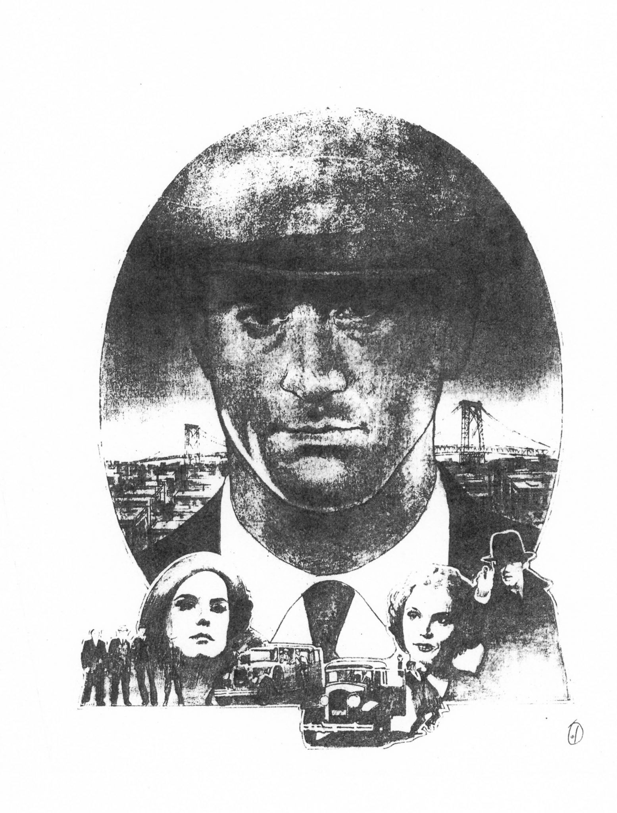

---

> This article contains spoilers!

Curator of the 60s Dollars trilogy (_A Fistful of Dollars, For A Few Dollars More and The Good, the Bad and the Ugly_) and equally appreciated _Once Upon a Time_ trilogy which ends with his gangster epic _One Upon a Time in America_ and **Sergio Leone** demise. Even though it had occupied so much of his career, this movie proved to bear fruit. Leone left us with his masterpieces to adore and decipher the ambiguity he cherished in his ambitious work.

Now to justify the title and make sense of this article, come with me to the story behind the movie with the    most decorated cinematic experience, pitched perfectly with the underlying theme providing a sense of poetry in the movie. 

It all starts with the several injustices that happened to **Leone’s** original masterpiece, the real director’s cut, which eventually never gets aired anywhere due to the various cuts made before it even came to any film censor board. We have created a timeline on how this happened.

And due to these major cuts in the original movie we never saw the real movie. And unfortunately maybe we’ll never be able to see the real “Once Upon a Time in America” by Sergio Leone in his utmost glory and his life work.This is majorly because of the legal issues over who owned the missing scene rights after Leone's death.

Now comes to the second part of this article which also supports our main idea. And this part is a try to demystify the ending scenes. _Once Upon a Time in America_ as we know the gangsta cult classic adaptation based on **Harry Grey's** novel _The Hoods_, whose main genres revolve around crime and drama, but what if I tell you this movie was a psychological thriller? Sounds peculiar right?
And it turns out Italian maverick is yet to surprise us. What else can you expect from a man who turned down the direction of _Godfather_ to make this movie.

After watching and analyzing the movie 3 times, those are the 15 hours of my life that I won’t regret and the un-butchered 251-minute version shown at the **2012 Cannes film festival** has some other story to tell which is by the way restored by, and you won’t believe it, **Martin Scorsese**.

There are some alternate theories justifying the ambiguous last scenes of the movie like the one time when it was not clear weather Mr. Bailey actually jumped on that truck or he slipped away through that garbage truck from the right side to the driving seat and moved away to isolation as a self punishment for what he did to Noodles. There are three instances in the movie that are related to these hypotheses.

1. The last uncut sense, that was later removed from the movie during public release, when Jimmy hinted Mr. Bailey to commit suicide by saying: _“I'd be very happy for you tonight, if during all the noise of the party I'd hear a shot.”_ because he’s going to be killed by their associates because of the mistakes Mr. Bailey made and the corruption on going investigation had only added to the suicidal motivation of Mr. Bailey.

2. Another instance where Mr. Bailey and Noodles were talking in Mr. Bailey's office. Noodles said: _“I hope the investigation turns out to be nothing. It’d be a shame to see a lifetime of work go to waste.”_ Noodles doesn't want Jimmy’s associates to kill him neither does he want Maxie to kill himself.

Here is the conclusion that I have devised from the above points. Mr. Bailey never jumped on that truck to kill himself nor did he sit on the truck to escape from the associates.

> Mr. Bailey never jumped on that truck to kill himself nor did he escape from the associates, he simply disappeared.

So what really happened there?

It’s a paradox! Maxie/Secretary Bailey was never there, not even Noodles as all his adult life, the 35 years of exile and meeting with Maxie and Deborah and all of the story around there is just the yield of his imagination! All his fellows were dead during the encounter at that same day and Noodles can’t comprehend the fact that really happened so he made up a story when he got high at the chinese opium den but then at the end he was regaining his consciousness back from this narcotic dream, so all you see is a man fighting with himself to have a sense of reality and now he’s trying to accept the truth. There are many references of this in the movie.

1. After Mr. Bailey jumped on the garbage truck some cars pass by Noodles, that seems (but we are not sure) to be the cars from party which Mr. Bailey son David was going, after the truck back light fades away three cars from the 40s pass by before Noodles, which is an absolute enigma as this is after 35 years of Noodles isolation which means this is the 80s!

2. In the last part of the movie where Noodles was getting out from that back door he says _“… I have a story also. A little simpler than yours. Many years ago I had a friend, a dear friend. I turned him in to save his life… but he was killed. But he wanted it that way. It was a great friendship. It went bad for him and it went bad for me too. Good night, Mr. Bailey.”_ And this quote also justifies point number one. At the end of the scene, Noodles was somewhere getting out of the high and his continuous mind is trying to fight with the imaginary world he has created and wants to live with his fate as a man who sells his own friend which ultimately led to their death.

3. You must see this one coming. When Noodles comes out of Deborah's room after getting to know Max/Secretary Bailey is her husband he sees David, Deborah and Max's son, but don’t you find this peculiar, it is the same child actor who played Max when they all were younger in the movie? This absolutely blows my mind. There are two reasons for this, first to tell the audience that this is the youth of Max or son of Max and the second is since all this is a construct of Noodles mind he imagined his old friend as it is only adding to your conclusion.

4. That smile man that smile. When he woke up in the chinese place he smiled. The man whose friends, lover and his business has ended. Why would he smile? Does he accept his fate? Does he become crazy? We don’t actually know but if our above theory persists, that concludes he realized this is the reality and he wonders how he imagined his lifetime, it was all a lie.

After watching this movie we can understand what gives a passionate man and 10 years to a single film. Soon after he died 5 years after the first release of this movie it remains a classic from time to come. Things this movie communicated far surpasses the script, somewhere in those 34mm Cellulose Nitrate film rolls lies our life stories, yet to be discovered, yet to be heard.

---
### Additional sources

- Suggested song: [Once Upon a Time in America - The Danish National Symphony Orchestra](https://youtu.be/yRDDflQlvgc)
- Once Upon a Time in America [Wikipedia](https://en.wikipedia.org/wiki/Once_Upon_a_Time_in_America) page
- Alternate Versions from [IMDB](https://www.imdb.com/title/tt0087843/alternateversions)
- [13 Epic Facts About Once Upon a Time in America](https://www.mentalfloss.com/article/70066/13-epic-facts-about-once-upon-time-america) by Eric D Snider
- Release Info from [IMDB](https://www.imdb.com/title/tt0087843/releaseinfo)
- [How ‘Once Upon a Time in America’ Became Sergio Leone’s Butchered Swan Song • Cinephilia & Beyond](https://cinephiliabeyond.org/once-upon-a-time-in-america/) by Koraljka Suton
