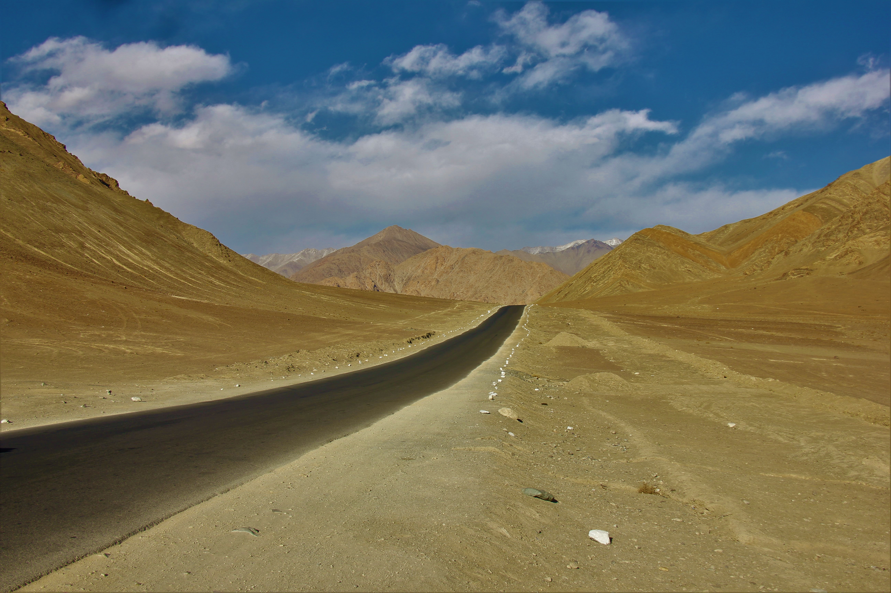

---

> “ There are three trips you take to India: the one you think you’re going to have – that you plan for; the one you actually have; and the one you live through once you go back home. ”
> _~ Erin Reese_

The Wonder that is India. More than just the temples, better than shown in Hollywood movies, and much more than just a country. While its culture and rituals fascinate a lot, some places still aren’t explored much. One such area is its law defining hills.

## Magnetic Hills, Leh Ladakh

<!---
By AKS.9955 - Own work, CC BY-SA 4.0, https://commons.wikimedia.org/w/index.php?curid=54945989
-->
Located in the north of the country, there is a place with the sigh board reading “The Phenomenon that Defies Gravity”. The Magnetic Hill (also known as Cyclops Hills) lies in the Trans-Himalayan region. It is a place where you can gravity is overshadowed by the magnetic field. People are asked to park their vehicles on a road (referred to as Magnetic Road) and put them in neutral with no handbrakes. Then they can witness the wonder of nature as the vehicle moves uphill on the road and has reached a speed of around 20km/hr.

## Tulsishyam, Gujarat

<!---
By Gazal world - Own work, CC BY-SA 4.0, https://commons.wikimedia.org/w/index.php?curid=52049334
-->
Located on the west side of the country, there is another road referred to as Magnetic Road which defies gravity and vehicles climb uphill when on neutral.

The popular theory surrounding the magnetic hill is that the hills emerge a great amount of magnetic energy thereby pulling vehicles upward. Many individuals have also experienced an upward pull in the area. Another theory that contradicts the above theory has arrived which explains all the events happening as an optical illusion. The illusion makes downhill look like an uphill. While there may be many theories among tourists and experts, locals believe that the road is a straight path to heaven, and only the deserving experience an upward pull.

Whatever the reason may be, these places must be added to every traveler’s list. After all, there is no place on Earth worth not visiting, is there?

---
### Additional sources

- Suggested song: [Yun Hi Chala Chal - Swades](https://youtu.be/eEeX2QMlSlo)