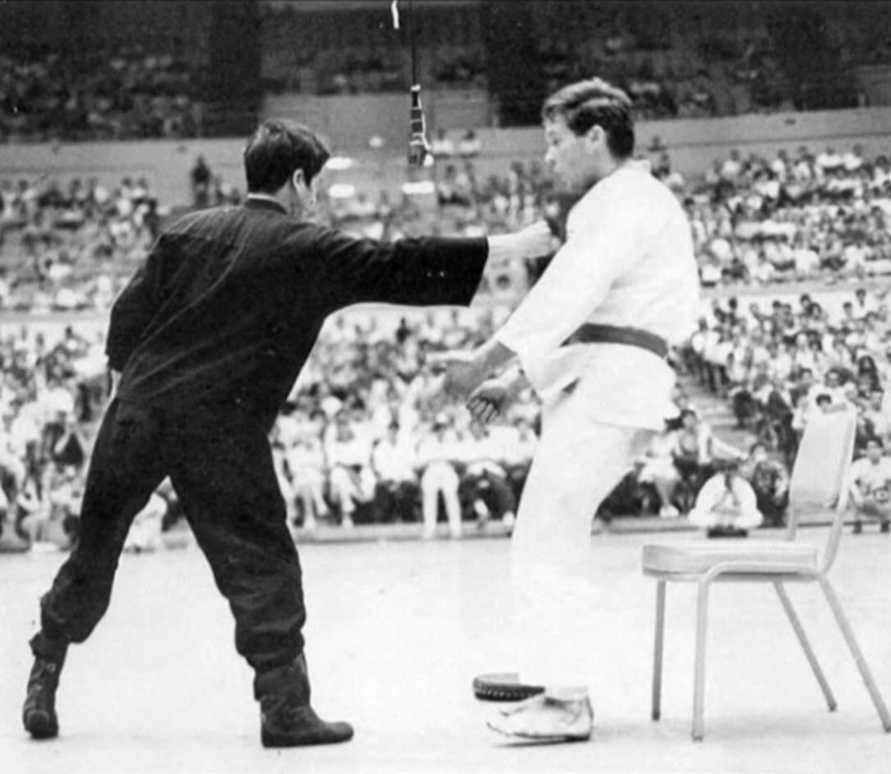

---

Popularized by martial artist Bruce Lee, the one-inch punch has made its way around as one of the remarkable moves of Chinese Martial Arts (popularly known as Kung Fu). The move is looked up as an exercise to strengthen the power of punching. Being performed only at a range of 0-6 inches, it can generate a terrific amount of impact force. A 6-inch punch by Bruce Lee sent the man drifting 16 feet. That’s the power it could generate if properly trained.

During a demonstration in History TV’s famous TV show ‘’Stan Lee’s Superhumans”, a Shaolin Monk named Shi Yan Ming showed his ability to one-inch punch over a human dummy. The result obtained was astonishing as the power generated was about 1.78 BC which was more severe than an injury obtained from a 30mile/hour car crash.

---
### Additional sources

- Suggested song: [Eye Of The Tiger - Survivor](https://youtu.be/btPJPFnesV4)