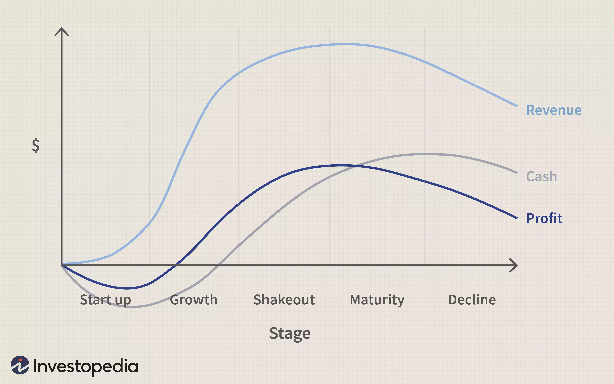

---

Does your life too seem like a chess game? Being a pawn from Monday to Wednesday, maybe a camel or an elephant for the next two days, a horse on Saturday and finally a drowsy King/Queen on Sundays? If it is, don’t worry you are just a normal working class human tired of your daily routine and looking for “That One Opportunity” that might turn your life from a sad Halloween to happy Christmas.

For generations this is how we are living lifestyle without taking time to evaluate ourselves. We simply pass this on to the next generation as we have been fed the same by our preceding ones. Maybe there is nothing wrong in it but maybe there is if you look at it. Why not be a horse every day rather be a pawn with too many restrictions. Yes, the horse too has its limitations but 2.5 steps is way better than 1.

## But what about I hate my work stuff?
Just don’t think about how much you hate you work, think about why you chose to do it in the first place. Let it be if it were a dream or a necessity. That way you might find a push that you desperately needed and were waiting for someone to do it, or simply you were waiting for ‘That one Opportunity’ which would never arrive. All you need to do is not pity yourself. In this way you will end up motivating yourself along with creation of some group of envious personalities. But you can’t argue with the fact that in every seed of good there is always a piece of bad.

## Try thinking like a PLC Curve
Think of yourself as a product. Then according to Product Life Cycle Curve, your work lifeline will comprise of 4 stages: Introduction, Growth, Maternity and Decline.

No matter how hard you try or how long you live, you will face these stages. So all you need to do is identify which stage you are on and prepare accordingly. Don’t sort out your stage on the basis of your age, rather figure out the stage based on your goals and satisfaction. Had age been the criteria, then you wouldn’t have heard about Colonel Harland Sanders or Ray Kroc or Julia Child who achieved so much in the latter half of their lives.

> The thing is that don’t stop until you are satisfied. All you need to do is take a moment, evaluate yourself and mount your curve.

---
### Additional sources

- Suggested song: 