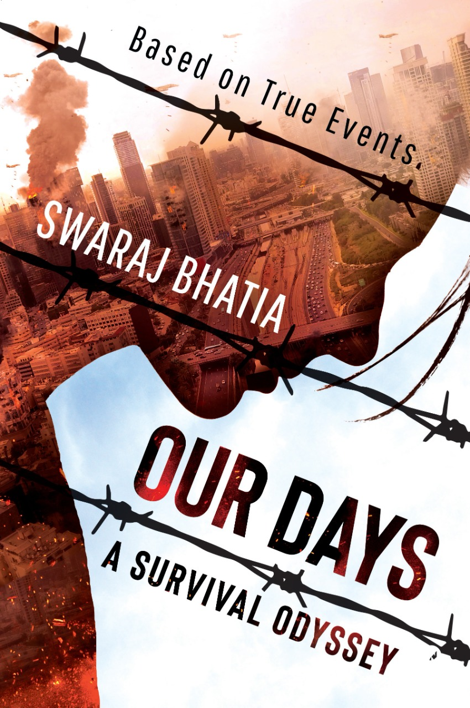
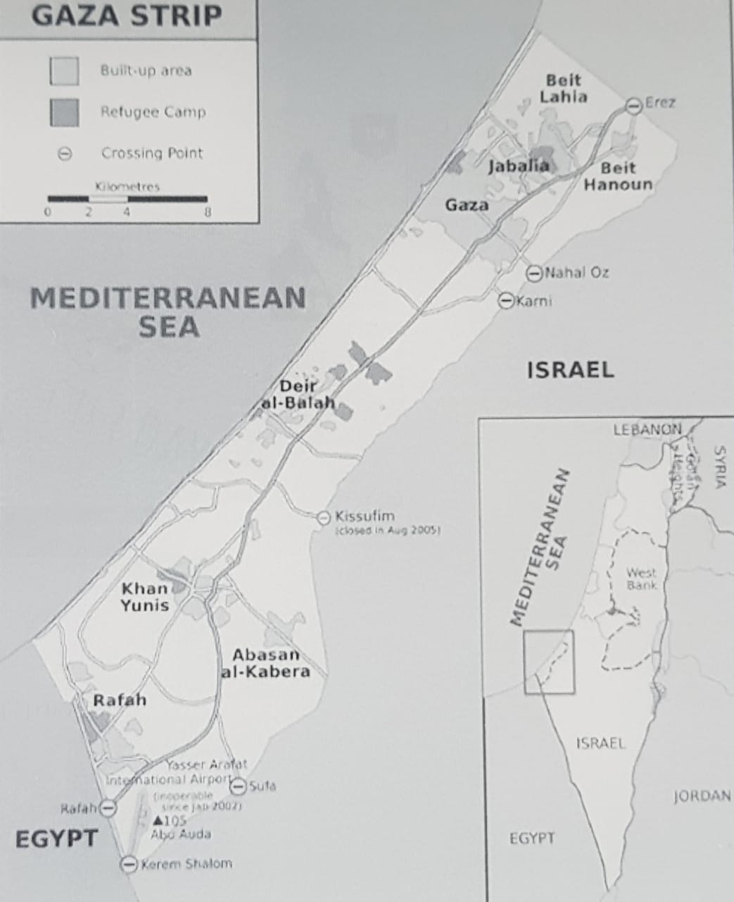

---

> Why does hate overshadow humanity? Can one human change the fate of hundreds of thousands?

Our Days: A Survival Odyssey by Swaraj Bhatia hooks up this brilliant idea of why humanity is never failing to astonish us even amid a blood-shedding war. The debutant author has smartly assessed the fact that no good thing can ever come out of lies.

The epicenter of the story is the Gaza Strip and the wrath it is facing from the hatred war between Israel and Hamas. To stop the ongoing attacks, the United Nations sends the protagonists Ex-CIA Spy Emma Glass and her husband Former-SEAL David to the gates of hell. Their job description is simple. To collect information and intel that can attain permanent ceasefire. But the unwanted journey goes south ways as now they are stuck in the epicenter of the war. It is up to them along with few comrades to survive the violence until the UN comes to their rescue. They witnessed the bloodshed, they saw the destruction, they watched hope crumble into ashes and most of all they felt the fear. They fell, they rose again just to fall again. The thrill in those moments of joy and failures set up the final moments is worth the wait.

The insertion of extra unrelated but exciting facts took me by surprise which made reading the book more immersive and fun. The author has done a fine job by using quotes as the header at the beginning of the chapters. The most impressive thing was that both sides and perspectives of the war were carefully explained which made me question my biases. The only thing one might worry about is the slow pacing in earlier chapters which will be ignored once you read further.

The author had thoroughly studied the Gaza incident which leads to a solid setup. The book is recommended to anyone who enjoys war drama, thriller fiction, and humanitarian drama. Even if you aren’t an avid reader I would highly urge and plead you to give this book a chance as the author wants to spread the message that in any case war and conflict must be avoided at all costs and this is the responsibility of the future generation to come. So please do pick up this book and give it a try. I promise you will not be disappointed at all.

> My Rating – 4.5/5 stars

---

### Additional sources

-   Suggested song: [Little Wing - Jimi Hendrix](https://open.spotify.com/track/1Eolhana7nKHYpcYpdVcT5?si=yivHUgTzQwSrmlBxmgIarw)
