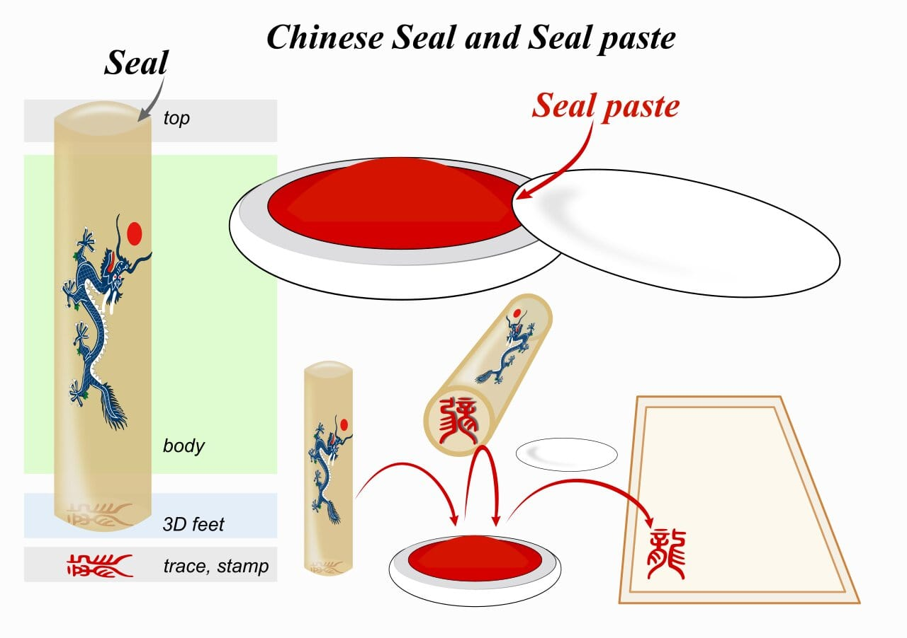

---

Isn’t it frustrating when you are asked to sign a document multiple times just to get that accurate signature that matches the previous records? Well, Japan certainly has its way to avoid this. Individuals in Japan use ‘Name Seal’ which replaces the need for a commonly used pen signature. The stamp or seal so used is referred to as ‘‘Hanko’’ (or just Han). The stamps contain the name of the person at the bottom which is then used for almost every legal purpose. The seal impression made by Hanko on paper is called ‘_Inkan_’.

Originated in China, Han stamps made their way to Japan (around AD 57) and were used by the cattle farmers to brand their cattle. Later, the stamps were used by Emperors to acknowledge their claims and possessions followed by the Japanese government in their official documentation. Even foreigners can have their own Han stamps which can be used while buying a house or opening a bank account. Many artists use Han stamps on canvas as their markings.

Being more than thousands of years old, Han stamps still haven’t lost their symbolism which shows Japan’s indefatigable efforts to preserve their folklore. Although forgery already made its way to these stamps, Hanko is still considered over-signature due to its historic and artistic value.

> PS- Custom made Hanko are available for people outside Japan via various websites.

---

### Additional sources

- Suggested song: [Hero's Comes Back!! - nobodyknows+](https://open.spotify.com/track/7weHG0yOwtAcZ0qBhyODLF?si=8DCFjX7cQ5us2hWBg--5sw)
