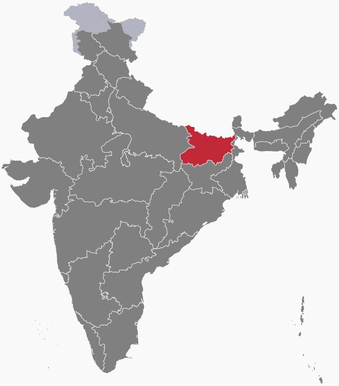

---

Before Covid-19 hit the nation hard everyone was convinced that the NDA would comfortably return to power in Bihar with Mr Nitish Kumar as the Chief Minister for the fourth term. As the Prime Minister announced the nationwide lockdown, we all saw the terrible effect it had on migrant labourers most of the come from Bihar. That’s when things started to change in Bihar politics with opposition parties rightly raising the issues of unemployment and the migrant crisis post lockdown.

Look at the major opposition party of Bihar that is ‘Rashtriya Janta Dal’ and its chief Tejasvi Yadav, along with the grand alliance including the Congress, CPIM, CPI and other left parties led a fantastic campaign. The credit should be given to the Mahagathbandhan for fighting this election on real issues that are plaguing the state. Even the BJP had to talk about jobs and governance in their rallies other than their regular high pitched nationalistic speeches.

So, how come the people of Bihar once again voted for NDA even after Nitish Kumar’s 15-year anti-incumbency? The thing is, people voted more for BJP than JDU, one thing that the _mahagathbandhan_ missed is people were tired of Nitish Kumar but they didn’t analyze the threat of BJP properly. BJP won nearly double seats than JDU and now Mr Kumar will be the CM for the fourth term as promised by the BJP and RJD has emerged as the single largest party by seat count and vote share. One thing is also a major factor in this result is the failure of Congress party to perform once again, even the left parties gave a good show, both CPIML and CPI gaining seats after many years.

The most positive thing that came out of this election was that it was fought based on JOBS, HEALTH and SECURITY which should always be the issues of any election.

---

### Additional sources

- Suggested song:
