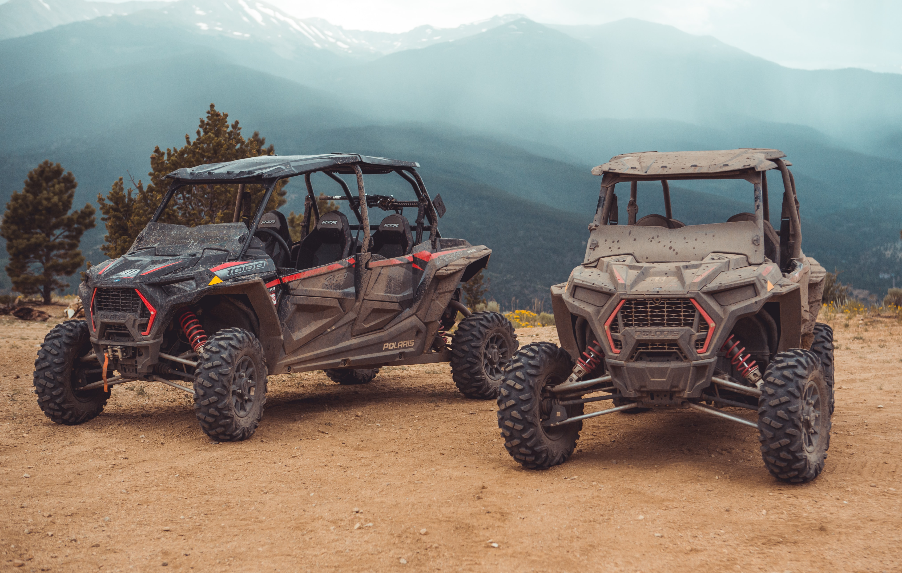

---

SAE BAJA is an intercollege design competition where teams of 25 students each come together to design, fabricate and test a single seater all terrain buggy. The vehicle is designed according to the rule book published by ‘Society of Automotive Engineers’. The event goes on for 4 days starting with the technical inspection which consists of two parts ‘safety scrutiny’ and ‘technical evaluation’ in which the judges inspect the powertrain of the vehicle, the technical inspection is a very intense process as judges scrutinize every single part of the car according to the rule book and any discrepancy which can’t be fixed can lead to disqualification until the technical inspection is going on. After the technical inspection comes one of the most important test that is the brake test, the driver has to accelerate the vehicle in the maximum speed and then press the brake pedal at the designated spot in which all 4 wheels have to lock and every team has 3 attempts failing to clear the technical inspection and the brake test can lead to disqualification and the team is not eligible for any further dynamic test and the final endurance test as it is termed not safe for driving. 
The next step are the dynamic tests which are ‘maneuverability test’, ‘suspension test’, rock climbing’ and ‘sled pull’. The dynamic tests truly shows how a car really is as in suspension tests many cars roll over and have a breakdown like a major torsional bend in the chassis or sheared suspension arms and sometimes even fatal injuries to the driver. 
Static events are held during the first 2 days of the events along with technical inspection and the brake test these include ‘cost event’, ‘design evaluation’, and ‘sales presentation’. In the cost event teams submit their cost report of the car in which judges analyze the cost of the vehicle and the most economical car gets the most point. Design evaluation is the event in which the knowledge of the teams are tested to their core basics , teams submit their design report which consists of every single technical detail about the car like specifications, dynamic calculations CAE report and according to this data judges ask teams to validate their design according to the data they presented. Students have to pitch their design in a 10 minute sales presentation to the judges who are made to be in a made manufacturing firm, team with the most promising business plan gets more points.
The event ends with the final day 4 hour endurance race, the positions of the grid are decided by how much score a team has in their dynamic events. The team with most laps in the 4 hour long race is crowned the winner of the endurance race however the overall winner is decided by combining all the points from the Static and Dynamic events.

