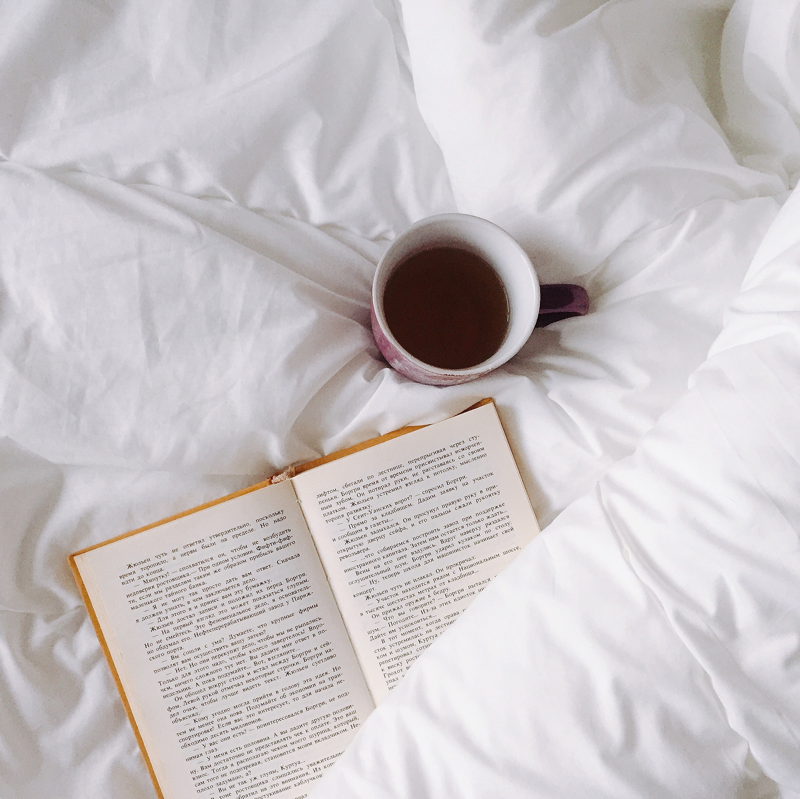

---

I remember when I first came to hear about the outbreak of Coronavirus in the Chinese province of Wuhan. At first we all thought it was limited to China but soon enough it spread all over the world and since the month of February things haven't been the same.

We are living in a pandemic. This virus has proven to be fatal and deadly and is highly contagious. A lot of speculations came in as the virus kept spreading. The concept of 'Social Distancing' was asked to be adopted by people to protect themselves from getting infected. People went into 'Self-Quarantine' and voluntarily locked themselves in their homes and decided to stay in. Some countries decided to adapt and enforce it all over the nation as a compulsory lockdown with strict rules.

So just like other people I've also been living at my home and rarely getting out for the last 3 months. I believe this time has been an unusual kind of experience for every person and it has impacted our lives a lot. We have those people who have unfortunately fallen to this infection and we have been losing a lot of people as well all over the world which is heartbreaking. My prayers go to all of the people going through this, who are fighting against this. We also have the people who are not as privileged and who may be facing the shortage of money and scarcity of food, water and shelter and I urge people to help any such people they find around them in any way and as much as they can. A lot of celebrities and influencers have come forward to join hands along with the people to help in fighting against this. People have joined in the cause and they are closer even though they are far. I'm sure we will get through this and when we look back at it it's going to be a part of our history with new endeavours.

Talking about people staying at home, we have started to do stuff to keep ourselves engaged but a lot of people are facing difficulties getting along with this quarantine life. We boredom creeping upon us and a messed up routine we all are faced with a situation of what to do to spend our time rather than be left with the feeling of wasting a lot of time. So here I will suggest a few things that you can do at this time.

## Reading

It is one of the most important habits that every person should develop in them. Reading not only is a great way to pass time but also gives you an opportunity to learn a lot. Humans have been writing in one way or other for ages to pass on information or any other kind of story. A lot of people think they can't read because it's really boring. Well you can start by reading some article (like this one), find out what intrigues you, what you find interesting. Reading is one of the best habits one can have. Rather than using your phone all day and sitting like a couch potato scrolling down your feed wall on your social media, learn something new and interesting and you might also get inspired. And a quick fact all the successful people read A LOT.

## Develop Skills

As we all should know learning never stops. You keep learning new things everyday. So why not try to do some online courses to learn something new and develop skills in that? Maybe learning these new skills can help you in some way in your life. Whatever be your interest there's no issue in trying new things. So give up that hesitation and next time you're browsing the Web, do a little extra and open some websites and find out some nice online courses that suit you and do them. Be it whatever, just look up something and start right away.

## Connect with friends and family

When I say connect it doesn't mean send your friends memes or like some pictures of them or send some messages on your family group. Call them, be it video call or voice call. Let them know what you're doing. If you're at a distance from them let them know you're alright, you're safe and healthy. Humans are social animals. So remember that and rather than keeping all your thoughts in your head share your feelings with your loved ones. Connecting with them this way will keep your mental health at a good level. They will also feel happy and the desire to meet them as soon as possible will grow stronger too. So pick up the phone and ring people up.

## Fitness and Health

Staying at home forces us to reduce our locomotion and movement. Sitting at one place seems very comfortable but it isn't good at all! Get up and do any physical activity possible. Do some domestic chores, make a routine, fix your sleeping schedule and don't use the phone too much. Sleep on time and wake up early. Do some basic exercises like push-ups, crunches, sit-ups, burpees etc. You don't know how much 30 minutes of workout can boost your immunity as well as your mind. It gives you positivity. You'll feel good. Also remember to eat a little less than usual because it might be good to adjust your diet according to the daily routine. Overeating should definitely be avoided. So keep in mind about your health.

## Social Media Detox

Anything consumed in an excessive amount can be poisonous and fatal. The same counts for your social media intake as well. Social media has been designed to keep people engaged and get people addicted to it. We all like to be on social media and it has become an essential part of our life and a lot of people have their business on it or some other work. I get it. But we must abstain from it as much as possible. The first step could be to analyse how much time you are spending on social media and slowly try to reduce it or if possible delete that app for a while and take a break from it and you'll realise how much you have been missing on.

> Well I've given out a few points and I believe there are a lot of more things that we can do to improve our quarantine life. I hope you find this article helpful and the information I gave out helps everyone. I hope everyone is staying at home and staying safe. We'll get through this!

---

### Additional sources

-   Suggested song:
