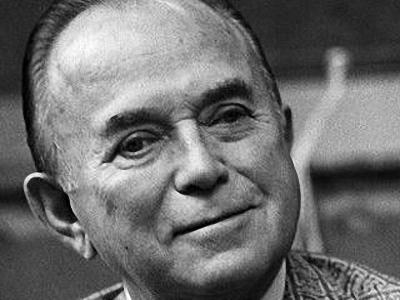

McDonald's is one of the well recognised names in the fast-food world. It is often credited with the development of Fast Food Business and Franchises. The birth of McDonald's was the labor of love of two brothers who had a dream: Be Millionaire by the age of 50. The duo Richard 'Dick' McDonald and Maurice 'Mac' McDonald, two Irish immigrants came to USA with a desire to be in the film making business. Their father, Patrick Mcdonald, a shoe maker were laid off due to old age and he was not provided any pension. The brothers were determined they wanted to be rich by the time they reached their father's age but they wanted their lives to be opposite of what they saw.

In the 1920s they reached California and joined Columbia Movie Studio and earned \$25/Week. In 1932 they bought and opened their own movie theater, 'The Beacon'. They opened their studio amidst the great depression. They only ate one Meal a day to save money, and it was at a hotdog stand. This gave them the inspiration to try out in the food business as that was the only open business at that time. So in 1937 they sold 'The Beacon' and got into the food business although they had no idea about it. They planned to create a drive-in restaurant.

They chose architect 'Stanley Clark Meston' to help them design their new restaurants. On a tennis court they drew the layout of the proposed store and had 5 employees take up roles of the 'assembly line' and that's how they took the measurements. But that night it rained and all the layout drawn with chalk on the court washed away and they had to start over. They were focused on creating a system which would be efficient and fast paced.

At last when they were finally ready they opened with a new menu with only three items. Burgers, Milkshakes and Fries. They provided car service and people would receive their order under a minute. Although people were not so much happy with the small menu and the fact that they had to throw away their own trash. But slowly and eventually their sales went by \$300,000 in 1953 and 1 year later they sold 21 Franchises.

Enter **Ray Kroc** a milkshake mixer salesman. He was getting requests from restaurants that they want mixers like they have at McDonald's. McDonald's was based in San Bernardino, and he was surprised to see although it was a small quiet town, they still owned eight Milkshake Mixers which cost \$150 a piece. Ray arrived at California for a business trip and decided to drop by at the McDonald's to see what's that all about. At first he thought it was just a normal drive-in restaurant but when he saw how fast and efficient it was, he was really impressed and decided to stick around and meet the brothers.

He requested the brothers to let him develop the franchises for them and at first they were hesitant as they didn't want much and were happy with what they had and didn't know how they would manage having so many stores and Ray volunteered to be the one who will do all the work. They agreed and Ray had a contract as he flew back to Chicago. The contract allowed him the right to open franchises, but he wasn't allowed to take the decisions and the brother's decision would be final and the agreement drew that 1.9% of the gross sale would go to the franchiser and 0.5% out of that was to go to the brothers.
Ray opened his first restaurant and he realized it was costing him a lot as he would have to develop the foundation of the restaurant as well. So he continued selling Milkshake Mixers to pay the rent while the bank was closing on him for his house mortgages. He saw his attorney if he could get a help with the contract and he was told if he continues with this contract he will go bankrupt. But he welcomed the challenge and He along with the CFO came to a conclusion that they are not in the restaurant business but rather they are into real-estate business and they started to endorse people that this is the business that people can have for themselves. Hence, a new Real Estate company was set up, and Ray wanted to buy out the brothers. They demanded $2.7 Million and wanted to keep the San Bernardino store to themselves as that time it made then $300,000. He agreed but was enraged and decided to open a store right in front of their existing store and drove them out of business and they lost out on the 0.5% royalty. If they had taken the royalty, they would have been billionaires but they were overthrown by Ray Kroc.
McDonald's grew exponentially and soon became a global brand and opened operations worldwide with having more than 38,000 restaurants and still increasing. That's the story of the world's biggest fast food chain McDonald's which is now recognised globally and is one of the biggest names in Food Business
