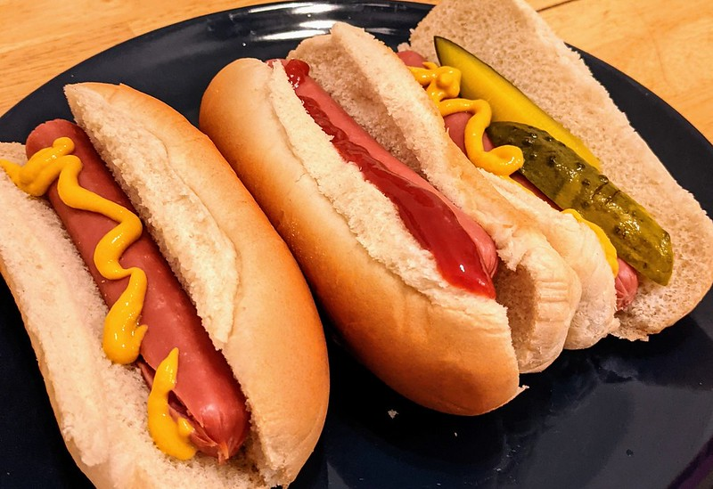
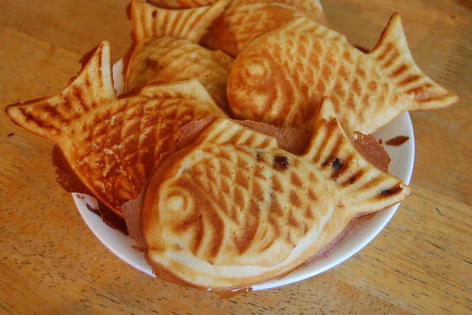
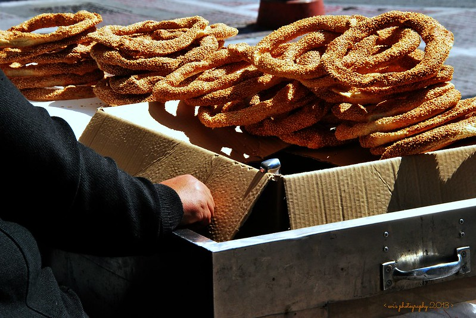
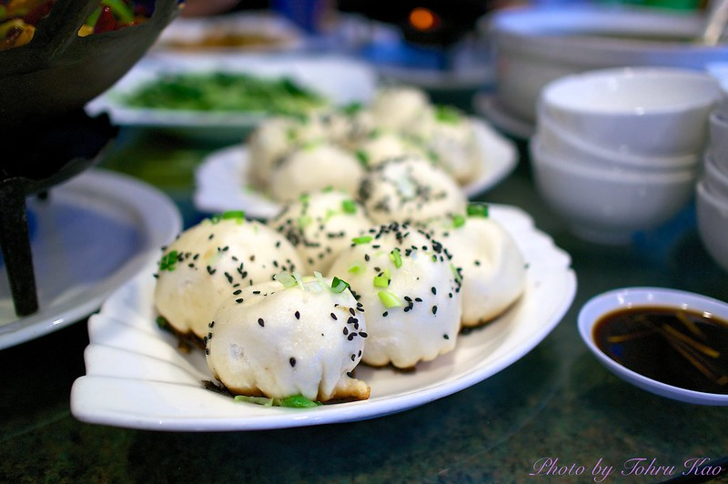
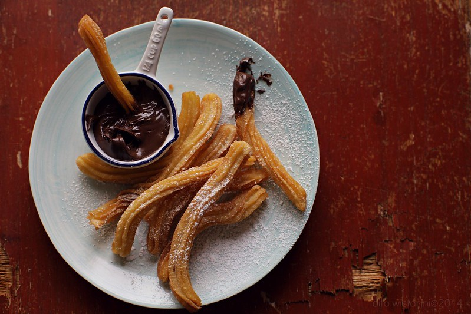
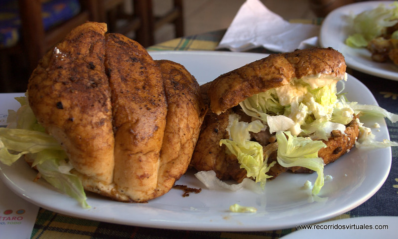
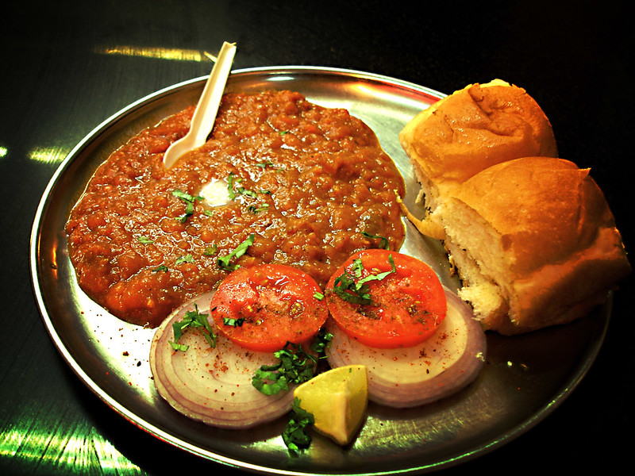

Street food is something that everybody craves for and it is one of the thing that can actually help you understand how the local culture and community is. Food tells a lot about the culture and helps bring people come closer and connect and understand each other.

The Street food has always been popular because its easily available, cheap, delicious and you can carry it around with you most of the times.

Here are some of the street foods that you can eat around the world and it costs only a dollar or almost a dollar.

## Hot Dog, New York, USA

  
Hot Dog is unarguably one of the most famous and well known food around the world. Even the people who haven't eaten it at least know its name. It consists of a Steamed or Grilled Sausage which is served inside a slit bun. It is usually served with Ketchup and Mustard but you can add other toppings as well. Hot Dog became really famous and came to be referred as 'working class street food'.You can usually find it around in New York in food carts.

## Taiyaki, Tokyo, Japan Cost

  
This is an adorable Japanese street food that is Fish shaped. Taiyaki means baked Sea Bream. The fish is called Tai (Red Seabream). It has a most common filling of red bean paste which is made from sweetened Azuka Beans. Other common fillings might be custard, chocolate, cheese or sweet potato.

## Koulouri Thessalonikis, Thessaloniki, Greece

  
Koulouri is a circular bread and it is encrusted with Sesame seeds and sometimes you might also find flax seed and sunflower seeds as well. The Koulouri Thessalonikis is baked and is crunchy on the outside and soft on the inside and you can buy it almost in every street corner or bakeries. It origins can be traced and found in the cuisines of the former Ottoman Empire and Middle East as well. The characteristics of the bread like crunchiness, chewiness, size may differ with regions.

## Pan-Fried Pork Buns, Shanghai, China

  
These pork filled baozi (steamed buns) are a speciality found in Shanghai. The pork and gelatin filling melts into soup when cooked. It has been a common street food in China for more than 100 years now. Its referred to as 'Shengjian Bao' or just 'Shengjian'.

## Churro, Madrid, Spain

  
Churro is a type of fried dough from Spanish and Portuguese cuisine. A Churro can either be thin with knots or be long and thick which is referred to as 'Porras'. They are usually eaten for breakfast and consumed by dipping in hot chocolate and often is served with sugar sprinkled on it.

## Guajolota, Mexico City, Mexico

  
Guajolota is a very common street food that you can find in Mexico. It is also known as 'Torta de Tamal'. It is essentially a sandwich which consists of tamal placed inside a bolilo or terela (a type of white bread). You can enjoy this savoury snack and it comes in multiple fillings as well.

## Pav Bhaji, Mumbai, India

  
Although India has a rich diversity, yet this is one of the most well known dish across the whole country and you can savour this almost in every corner of the country. The Pav Bhaji consists of a 'Bhaji' which is essentially made by mashing veggies and cooking it to make a thick curry and it is served with 'Pav' which are sweet bread roans and these bread buns are toasted in butter and is usually served with chopped onions and tomatoes as you please.

These are some of the delectable and lip smacking street foods that you can find around the world and the best thing is it will only cost you a dollar or just a little bit over that.
