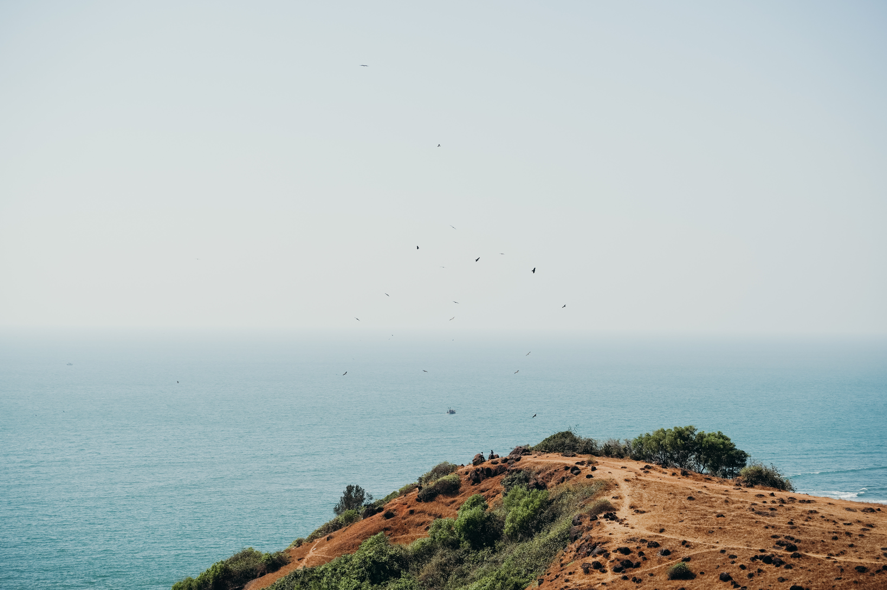

---

In December, in the middle of a pandemic, I went to Goa with my three coolest friends. We took a car and hit the road without planning anything. We drove 22 hours straight to reach Goa. We were staying near Dona Paula Police Station which was close to Panaji, capital of Goa. The best thing we did was we bought a map of Goa and marked all the places we went to. It created a sense of understanding of the roads and places in Goa. It helped to plan our trip in the morning as it became clear which places are nearby and what can be done after going to that place, it simultaneously enhanced our navigation skills. We travelled a lot and finally agreed on these 5 best places (mostly in north Goa).

## 1. Vagator Beach
It is the classic Goa go-to beach as it is has got the right essence of Goa. The beach is quite small in size and maintains a decent ambience. One heavenly good thing was the road leading to the Vagator beach. It just makes you wonder if heaven exists on the Earth. Anjuna beach is only 5 km away, so if you want you can add it to your list.

## 2. Panjim Streets
Another place which you must travel are Panjim Streets. In Panjim Church of the Immaculate Conception of the Virgin Mary is a famous tourist attraction. Apart from the church, you can visit the market, library and the streets where you can admire the Portuguese architecture. 

## 3. Viva Panjim
Hands down Viva Panjim have served the best food I ever had. The restaurant serves authentic Goan cuisine. The food was warm, delicious and not too expensive, what else do you need. A dish I would vouch for is the caramel pudding, it was succulent and mouthwatering. Another alternative is the Heritage Bistro where food is fine but you would like to have their drought beer, they serve it ‘as cold as your ex’.

## 4. Arambole breach
It is one of the most beautiful beaches in Goa, it's becoming a huge tourist place. The best part is the beach is not heavily crowded. It is quite and clean. It is in between the Mandrem Beach and Keri Beach. You can see more foreigners on this beach, they seem to like it. The openness of this beach wants you to just stay here and grab a beer. 

## 5. Colva Beach
It’s a breathtaking white sand beach in south Goa. The cold sea breeze blowing at the beach will make you alive instantly. The aura of the beach is relaxing and healing. It is only 15 km from the airport, so it can be a good place to stay in South Goa. There are a lot of beaches near Colva beach including Sunset beach, Betul beach, Canaguinim beach. This makes this beach a unique place to visit.

---
### Additional sources

- Suggested song: [Fly Me To The Moon - Kaikane](https://open.spotify.com/track/3WtHeD1MkPYh1o5Bta94uL?si=N6Zb4TFLQm66ppNbI7WZfg)