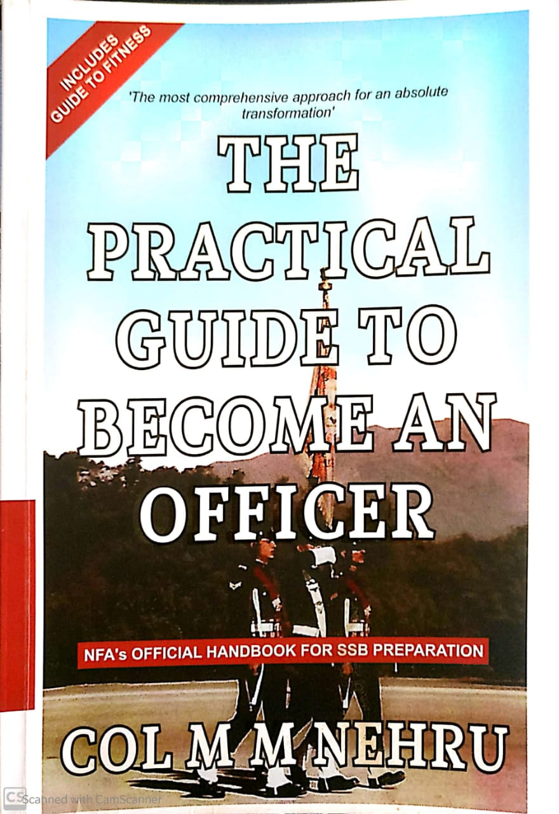
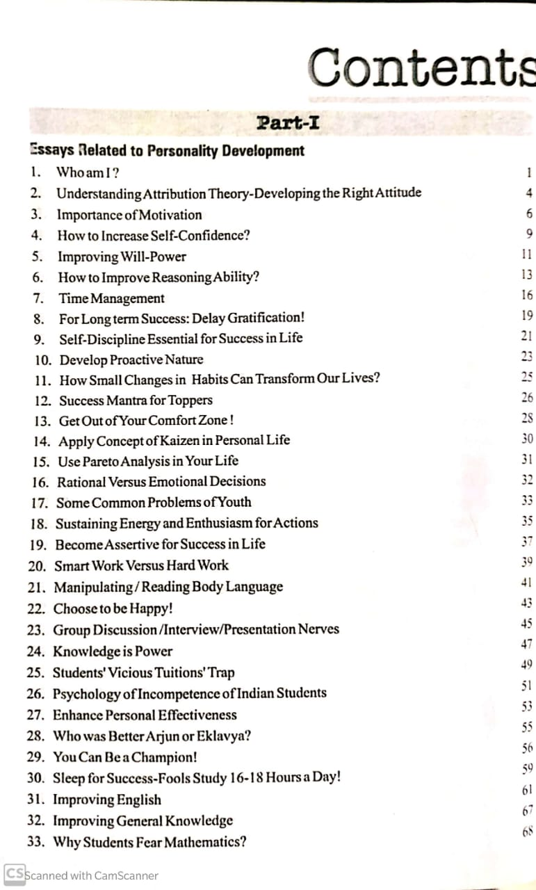
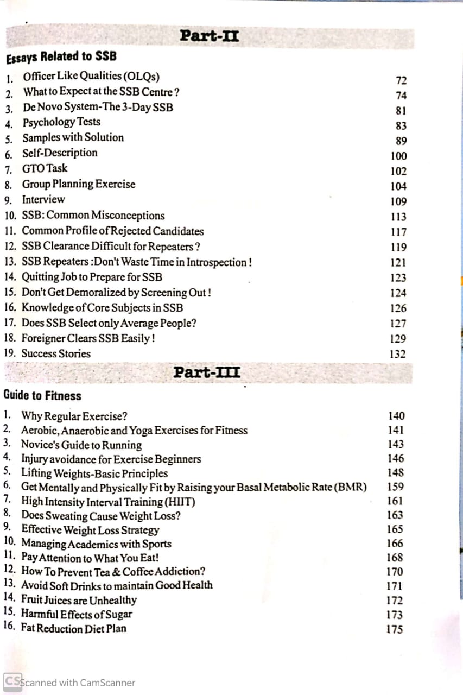

---

Shubham asked to Col. Nehru:

> “I go blank when I see some pictures in TAT. What should I do?”
> Col. Nehru replied:
> “Please save your time. Don’t go for SSB. When a picture can cause you to go blank then an armed enemy will also make you go blank. I can’t solve your problem. We don’t need such officers!.”
> Written by Col. Nehru, the book’s message is clear, short and simple ie. improve yourself every day. He explained the whole procedure of SSB. The book is divided into 3 parts, part 1 is Essays Related to Personality Development, part 2 is Essays Relayed to SSB and part 3 is Guide to Fitness. The chapters are written in a sequence which will help the aspirant to go through the book easily.

In the first part, the author talks on subjects like self-improvement, discipline, habits, happiness, knowledge. Essays in this part are well written that can help the reader to make the correct mindset for success. Everybody should read these essays, It’ll help them in their career.

The second part is all about SSB. Brief introduction of all the tests, day-wise is given in essays in this part. Two of my favourite essays are “Common Profile of Rejected Candidates” and “Don’t get demoralized by Screening out”. These essays are most important for the aspirants as it deals with the most difficult part of the selection process.

The third part is a guide for fitness. General information about fitness, health and diet is given in this part.

The book is not about how to crack SSB but on personality development and habits. Col. Nehru emphasised on personality development to achiever whatever goal you have in your life. According to him, you shouldn't be wasting your time in coaching or tuitions rather a student should utilize the time to explore his/her hobbies. This will help the students to develop different kinds of skills which will eventually help them to achieve wholesome success. He also talks about myths which are being circulated about the SSB selection process. He clears most of the common doubts which student have about the SSB.
I recommend this book to school students. By reading this book they’ll know that most of the jobs demand a set of skills, by focusing on just one aspect leave you with a lack of other skills. They can build themselves from a young age so that in future they can clear SSB if they want to join the defence forces.

---

### Additional sources

-   Suggested song: [The White Stripes - Seven Nation Army](https://youtu.be/RDuzszjrdcc)
