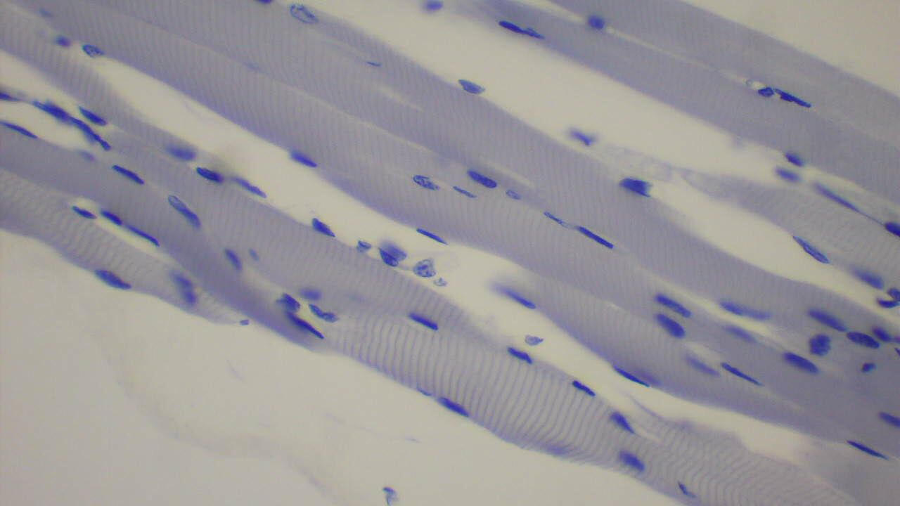

---

Since the beginning of mankind, homo sapiens have always been involved in physical activities. It may be hunting or moving from one place to another, everything we did involves some kind of physical work. Throughout the evolution process, different civilizations took place leaving us with a highly random pool of genetics. Our muscle fibre is also built differently in each person like every other characteristic, but how does it become different? What is the key feature?

Our muscle is made up of small tiny fibres enclosed in elastic tissues. These muscle fibres contract and relax on a given signal by our brain. Now all of us have varying muscle mass in our bodies, it also plays a very significant role in defining our physical capacity. Other factors like amount and technique of training also affect. But what we are primarily talking about is an unchangeable aspect of our body which is a type of muscle fibre arrangement as there two types of muscle fibres:

1. Slow Twitch Muscle Fibers (Type I)
2. Fast Twitch Muscle Fibers (Type II)

Both the fibres are arranged in a random manner. While using the muscle both the fibres come into play. Their arrangement is dependent on genetics. People who have more slow-twitch muscle fibres are better in endurance activities whereas people who have more fast-twitch fibres have greater explosive strength. Some of us also have a good combination of both the fibres, which create a combination of both endurance and explosive strength.

## How to Train for Optimal Performance

As we have discussed that both the fibres are genetically present and we can't do anything to change it. What we can do is train both the fibres so that the optimal level of performance can be achieved. The basic training mantra is to do lightweight high reps exercise to target slow-twitch fibres and also do high weight low reps exercise to train fast-twitch fibres.

---

### Additional sources

-   Suggested song:
