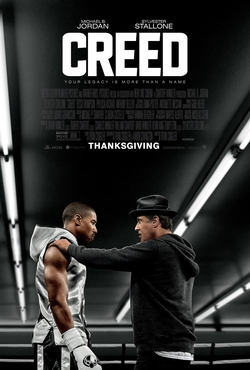

---

Creed is the 7th instalment to rocky series. Adonis Johnson, the protagonist, is homeless and somehow involved in fistfights. Late Apollo Creed's wife tracks down Adonis and adopts him. He grows ups self-training himself to be the world champion. He approaches Rocky to train him and to manage his fights. Rocky is getting older by this time and wanted Adonis to pick another trainer. What happens to Apollo Creed's son with Rocky on his side, who wanted the title is the movie is all about.

The essence of the Rocky series is present in the movie. The training sequence is so genuine that you'll fell Creed is the mirror image of Rocky I. New characters are well written and directed. You can relate to the old character as if the whole series is a part of a big 15-hour movie. I think this movie still holds the best place in the Sports genre of movies just like Rocky.

---

### Additional sources

-   Suggested song:
