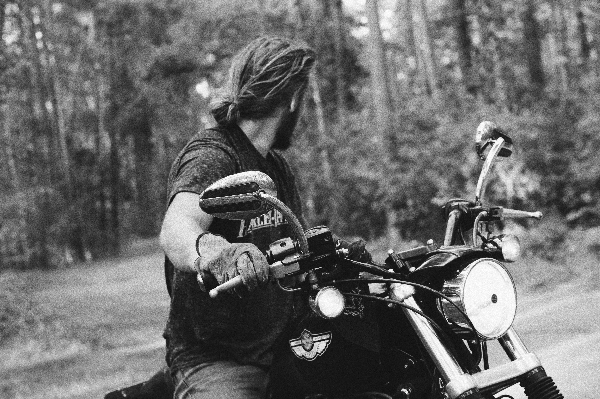
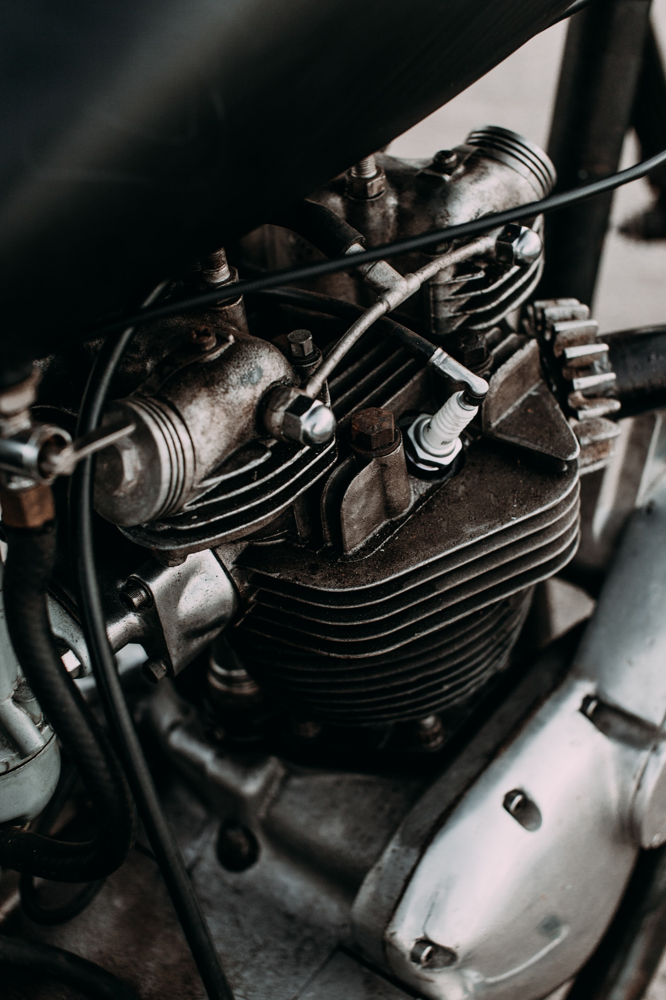
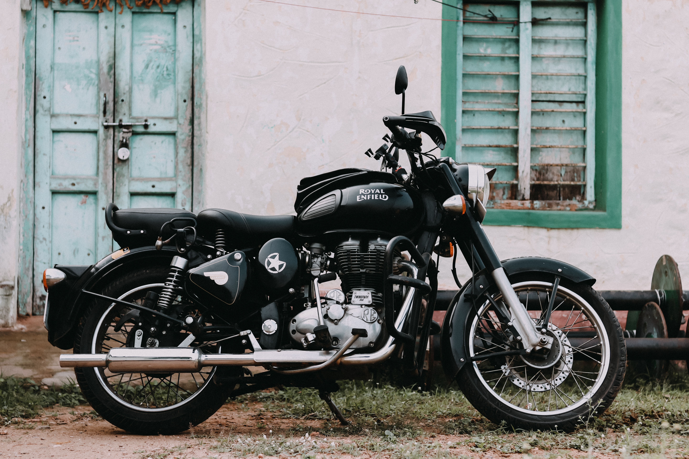

---

Bike enthusiasts are increasing every day in India. People want to ride a slightly more cooler bike in the weekend to get the trill of life going. We can't just ignore Royal Enfiled if we are talking about the motorcycle in India. RE has been the king of the market in their category, which is a retro-looking standard bike, not very powerful and vibrating. With sales figures for the years 2018 and 2019 being 8,26,098 and 8,20,492 units, people seem to like the machine. In Nov 2018 Jawa came up with 3 motorcycles to compete with RE, beating the famous 350 classics in terms of power output and performance. Both early adopters and critics like the bike but Jawa lacked service. Jawa sales crossed 50,000 units recently, that means Jawa can emerge as a true rival to RE.

In October 2019, The Benelli Imperiale 400 came in after the success of Jawa to enter an already boiling pot of competition. The retro looks with a premium design made an astounding impression in the market. More than 2,500 units have been sold since its launch. In a year the market becomes more competitive than ever. Now all the companies want to launch a product in this genre.

Yamaha has recently entered the market with the launch of Hness CD350 which brings new design on the table, more like Triumph Bournville. With these bikes coming in RE came up with an entirely new product launched this month, Meteor 350. Reviews of the new RE is good, vibrations are minimised and few new features are added. As a consumer, we have more than one option available to buy. The market is competitive which is hugely beneficial for the customers.

---

### Additional sources

- Suggested song: [Ride On - Dierks Bentley](https://youtu.be/A-_eGrRM2xI)
