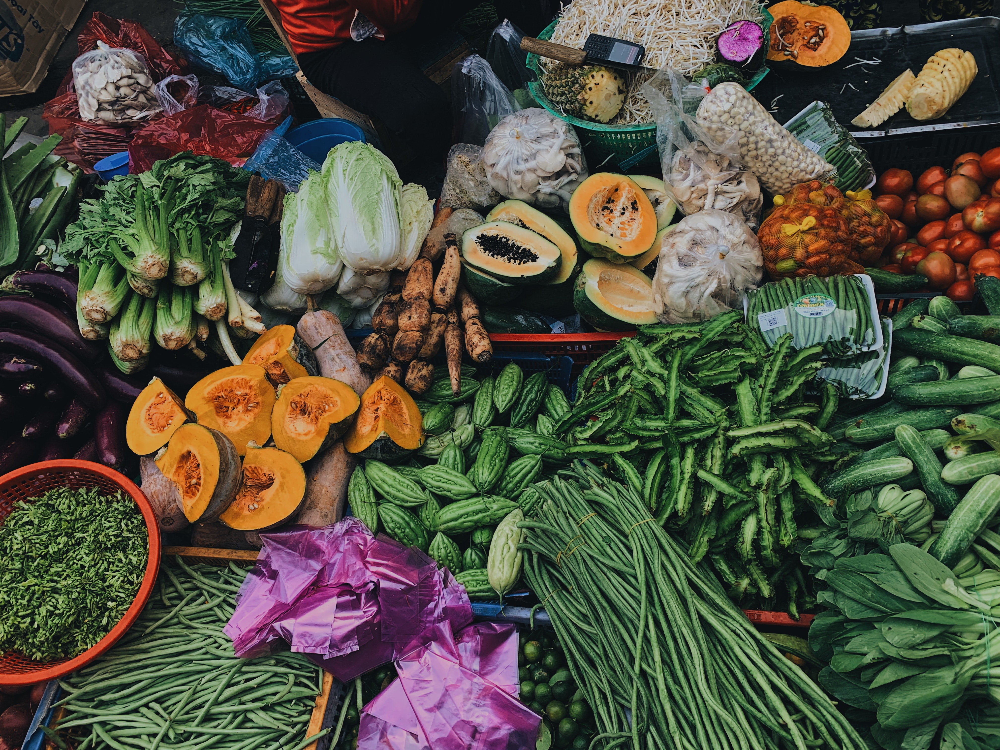
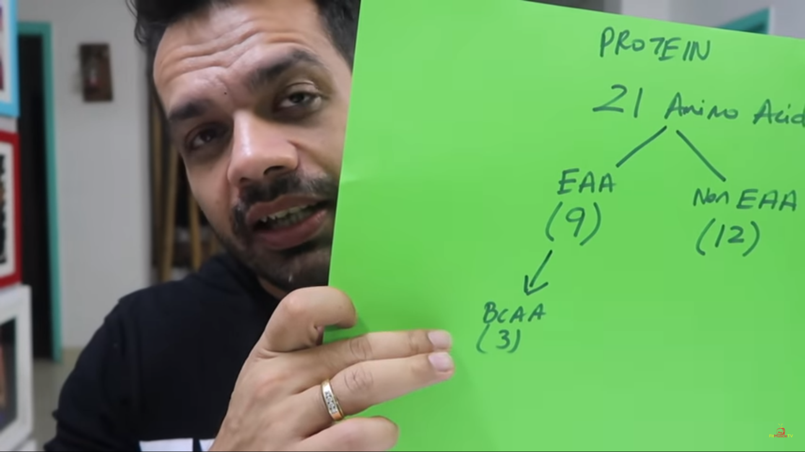

---

Whether you consume veg or nonveg, you can stay healthy as long as you’re eating the right food. The most common argument against the veg diet is it lacks protein which is not correct. According to a report by eatright.org, the veg diet is not only rich in nutrition but also environmentally friendly. Even competitive athletes can follow the veg diet. The vegetarian diet has a low level of saturated fat which is required by the body in low quantities. Vegetarians or followers of veganism are less likely to have obesity and heart related disease. Moreover vitamins and mineral content in veggies are very high.

## Protein

Now let’s get back to the general argument of protein. Amino acids are a small building block of protein. There are a total of 21 types of different amino acids which are further classified as essential and non-essential amino acids. Non-essential amino acids are produced inside the body even if you’re not consuming them. Essential amino acids come to our body from an outside source that is food. The reason why a veg protein source is not considered as good as a non-veg is that mostly a veg source doesn't have all the 9 essential amino acid present in it, one or two may be lacking. The amino acid profile decides which food has better protein content. Whereas food sources like eggs have a nearly perfect amino acid profile. Due to an incomplete amino acid profile, a vegetarian diet must contain protein from different sources to compensate for the missing amino acids.

At present, so many athletes are vegetarian, some of them have converted from the non-vegetarianism like Virat Kohli, Luis Hamilton, Leonel Messi, Scott Jurek, Nate Diaz, Patrik Baboumian, Novak Djokovic. So, if you’re a vegetarian you can be as good as these athletes if you train hard enough and eat good food.

