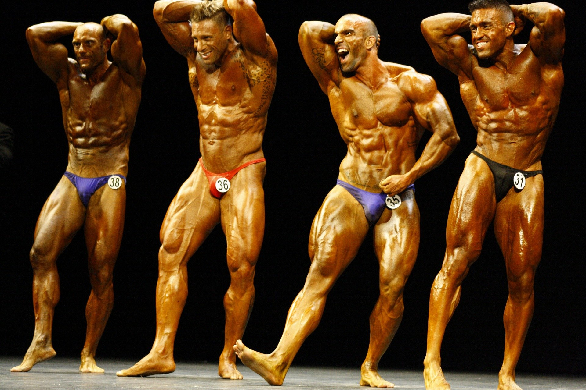

---

> Here is all you need to know about muscle hypertrophy
Have you ever wondered why bodybuilders become mass monsters and professional athletes like powerlifters look relatively small? Bodybuilder maintains an extremely low body fat per cent whereas strongman athlete carries a huge amount of fat. Bodybuilder lifts heavy but not as heavy as strongman athlete.

The reason is their training method and their purpose which is different. In bodybuilding, the factors like the amount of muscle mass, symmetry, conditioning and aesthetics are considered whereas the only goal of a strong man athlete is to become as strong as possible or lift as heavy as possible.

How does different in training change the aesthetics and strength of both the athletes?
Muscle hypertrophy is the increase in the size of muscle tissue. When you do exercise your muscle gets a pump, this pump is called muscle hypertrophy.

There are two types of Muscle Hypertrophy
1. Myofibrillar – Increase in the density of muscle fibres. Strength is increased. 
2. Sarcoplasmic – Increase in volume and mass. Glycogen storage of muscle is increased.

Bodybuilder’s primary aim is to increase the size of their muscle, so they focus on Sarcoplasmic hypertrophy more. Whereas other athletes give more attention to Myofibrillar hypertrophy. There are sports in which athlete want to have more muscle mass, in that case, they try to hit both.

---
### Additional sources

- Suggested song: [Believer - Imagine Dragons](https://youtu.be/7wtfhZwyrcc)