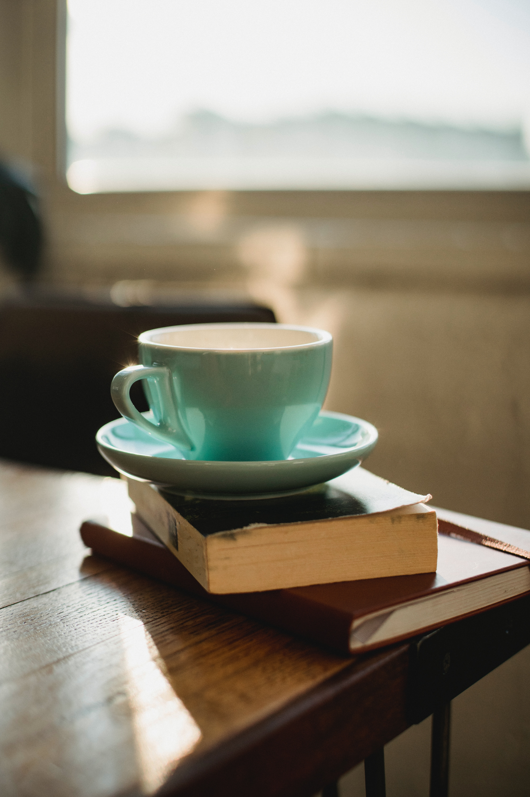

---

Drinking beverages has become a huge part of our daily life. Especially, in the modern era of highly restless and exhausting life. Whether it is tea or coffee, most of us are dependent on this psychoactive substance. The chemical stimulant is trimethylxanthine, which is a naturally occurring substance, also called caffeine. Caffeine is the most consumed legal drug present in beans, leaves, and fruits of 60 different plants. It affects our central nervous system (CNS) in a way so that we feel tried less and active. Since it is a type of stimulant, the effect wears off after some time and then you have to take another dose. This is also one of the reasons why people get addicted to it.

There are different kinds of tea available in the market. Black tea is the most common tea available mostly in all of the countries. The caffeine content of black tea is around 40- 80 mg per serving or cup. Other tea like green tea and matcha tea has great health benefits. Some teas are made with organic herbs without any caffine content like ginger and tulsi tea. Tea can be acidic or basic depending on the type, green tea is considered healthy because it is basic and has antioxidants present in it. The main symptom of acidic beverages is uneasiness in the stomach, which is absent in most of the teas.

Coffee, on the other hand, is very high in caffeine. Of course, the amount will depend on the type of coffee, but it generally varies from 80- 150 mg per serving which is more than double as compared to tea. Coffee is acidic and can cause stomach irritation when consumed in high quantities. Because the amount of caffeine is very high the half-life of coffee is 6 hours. So if you want to take sound sleep at night you gave to avoid coffee at least 12 hours before going to bed. Studies have found the link between brain function with a high caffeinated beverage, people also use black coffee as a pre-workout.

Both tea and coffee are beneficial for our health if we take the best of both the drinks. Make a good combination of both according to your lifestyle to optimize your life to the maximum. You can be partially dependent on caffeine but what makes most of the enthusiasm is your overall activities throughout the day. Drinking hot brew over a table of conversation with friends on the weekend is what makes it the best beverage.

Here is my recipe for a hot cup of coffee:

> Take 5 g of instant coffee in a coffee mug and add 5 g of chocolate power (Natural Unsweetened). Now boil one cup of milk and pour it to the cup using a strainer. Mix with a spoon. Serve it with a handful of Almond and Cashew along with some peanuts.

---

### Additional sources

- Suggested song:
