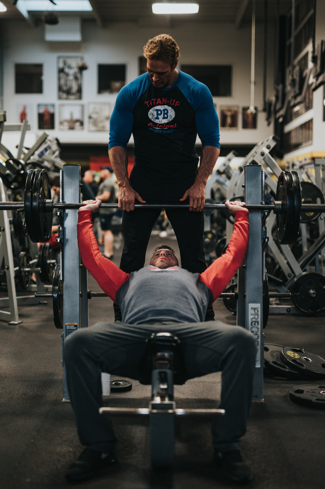

---

We all know it's hard to get the time and do exercise while doing work the whole day, but if you trick the mind to just hit the gym for the day then you’ve won the game. Especially, during quarantine, we need to move more. The best part is your stress hormone, adrenaline and cortisol will go down. Moreover, you’ll feel better because your body is now happy as it has got what is needed. Endorphine is released during exercise which elevates your mood and then you can focus on your work better.

The fitness goal of most people nowadays is to get strong and aesthetic. To achieve it you have to focus on the three basic pillars of fitness which are workout, sleep and diet. While most people want a shortcut, some people want to do it in an old school way. What the masses don’t know is there is no shortcut to building a Captain America or Black Widow physique. The only way is to do hard work and be consistent with a good diet. Doing hard work not only makes you a real-life superhero but also its whole lot of fun to do. People often get addicted to exercise or their favourite sport because that’s how our body is evolved. Ancient hunters and gatherer used to walk and hunt a lot, the way we’ve evolved is completely opposite to today’s sedentary lifestyle. The human body is programmed to move and eat a lot not to sit and eat less. Now that you got the idea that exercise is good for mental and physical health. Let’s take a look at the top exercise for muscle building –

## 1. Barbell Row

This exercise puts pressure on your rhomboids, rear delts and biceps. It also engages your lower back and glutes. It is one of the best exercises to create a thick and wide back.

## 2. Bench Press

Chest press or bench press is a push exercise that uses the chest, front deltoids and triceps. It can be helpful for pushup progression and it hugely improves upper body strength.
Pushups can be done to replace bench press as the same muscle get trained in both the exercise.

## 3. Squats

The best lower body exercise, primarily focuses on quads, calves and glutes. Lower back and hamstring also get trained.

## 4. Deadlift

Deadlift according to me is the best exercise you can do in the gym because it focuses on multiple muscle groups at the same time. Since many muscles are used in this movement you can lift heavyweight while performing it. The muscles involved are hamstrings, glutes, inner thigh muscles, core, lower back, traps, quads, rhomboids, erector and obliques.

## 5. Pull-ups

Upper back exercise for V-taper look focuses on the infraspinatus, lats, traps and thoracic erector spine. It targets all the upper back muscle providing strength and stability to perform other exercises in the gym.

We all know it's hard to get the time and do exercise while doing work the whole day, but if trick the mind to do just hit the gym for the day then you’ve won the game. Especially, during quarantine, we need to move more. The best part is your stress hormone, adrenaline and cortisol will go down. Moreover, you’ll feel better because your body is now happy as it has got what is needed. Endorphine is released during exercise which elevates your mood and then you can focus on your work better.
