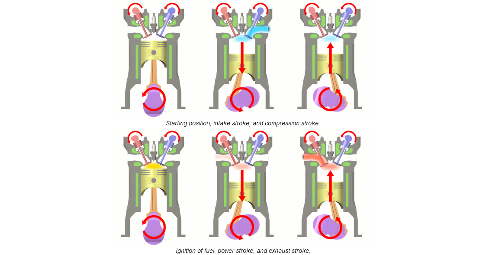

---

What are the 4 strokes of an SI engine?
The internal combustion engine is the power generating unit of an automobile. The IC engine mostly runs on eighter petrol or diesel. There are two most common types of IC engine which are 2 and 4 stroke engine. IC engine has a piston-cylinder arrangement. The piston moves up and down inside the cylinder, covering a displacement. The topmost position of the piston inside the cylinder is called the top dead centre (TDC). Similarly, the down most position of the piston is called the bottom dead centre (BDC). When the piston moves from one Dead Centre to another, it’s called a stroke. In a four-stroke engine, the piston moves 4 times between TDC and BDC in a single cycle ie. it’s called a 4 stroke engine. In the same way, in two strokes engine the piston moves twice in between the Dead Centres in a cycle. In the cylinder, when the piston is at TDC there is a small volume present to hold the air-fuel mixture while compressing it, it's called clearance volume. This is the volume where the combustion of the air-fuel mixture takes place.

2 stroke engine is outdated because of multiple reasons including low efficiency, high smoke production, more noise pollution and high wear and tear of machine parts.
Now let’s take a look at the working of the 4 stroke petrol engine. It is also called Spark Ignition or SI engine, which runs on the Otto cycle. The whole design of an IC engine is very complex, just for the sake of understanding we are taking a simpler piston-cylinder mechanism. 2 valves are present on the top of the cylinder, one inlet and one outlet valve, along with a spark plug. As shown in the diagram below, the red valve is an intake valve and the blue valve is an outlet valve. The piston is connected to a connecting rod which is attached to a crankshaft. The primary aim of the IC engine is to rotate the crankshaft by generating enough power to sustain the entire system.

  

Four-stroke cycle used in gasoline/petrol engines: intake (1), compression (2), power (3), and exhaust (4). The right blue side is the intake port and the left brown side is the exhaust port. The cylinder wall is a thin sleeve surrounding the piston head which creates a space for the combustion of fuel and the genesis of mechanical energy.

The 4 Strokes of Engine

1. Suction/Intake stroke – In the intake stroke the piston starts its movement from the TDC going in the downward direction. While going down the free volume inside the cylinder increases decreasing the pressure inside it. At this moment the intake valve opens. As the pressure inside the cylinder is low the air-fuel mixture from outside comes inside the cylinder via the intake valve. It happens till the piston reaches BDC.
2. Compression stroke – The piston starts its movement from BDC to TDC compressing the air-fuel mixture. Both intake and outlet valve are closed in this stroke. The pressure inside the cylinder increases along with the temperature.
3. Power stroke – It is called power stroke because in this stroke the power is generated. The piston is just about to touch the TDC and both the valves are closed. At this moment the spark plug produces a spark to ignite the mixture. Combustion takes place, a small blast that rapidly increases the pressure of the mixture pushing the piston down with a huge force. This force is used as a power source to move the vehicle.
4. Exhaust stroke – The piston moves up from BDC to TDC with high velocity. The air-fuel mixture has burnt completely producing flue gases. The outlet valve opens to eliminate the flue gases from the cylinder. The piston which is moving up pushes the gases to move out of the space to again decrease the pressure so that fresh air can come next.
