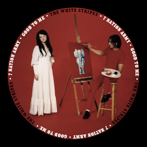
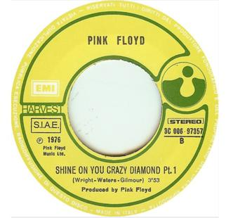
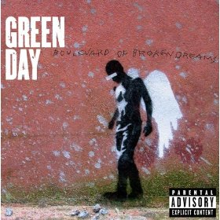
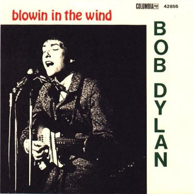
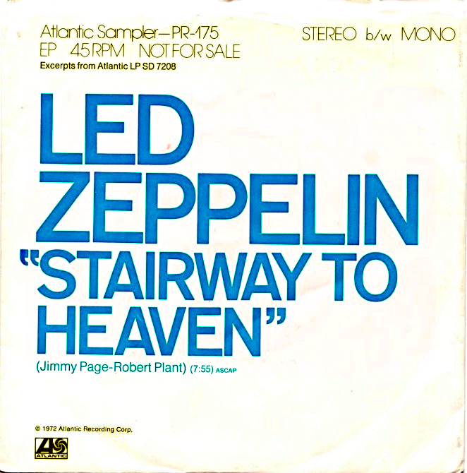
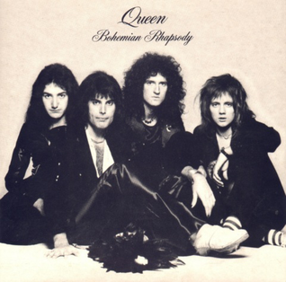

---

### 1. Hotel California by Eagles - 1976

### 2. Seven Nation Army by the White Stripes – 2003

## 3. Shine On You Crazy Diamond by Pink Floyd - 1975

## 4. Boulevard Of Broken Dreams by Green Day - 2004

## 5. Yellow by Coldplay - 2000

## 6. Numb by Linkin Park - 2003

## 7. Blowin' in the wind by Bob Dylan - 1962

## 8. Stairway to heaven by Led Zepplin - 1971

## 9. Bohemian Rhapsody by Queen - 1975

## 10. Highway to hell by AC/DC - 1979

