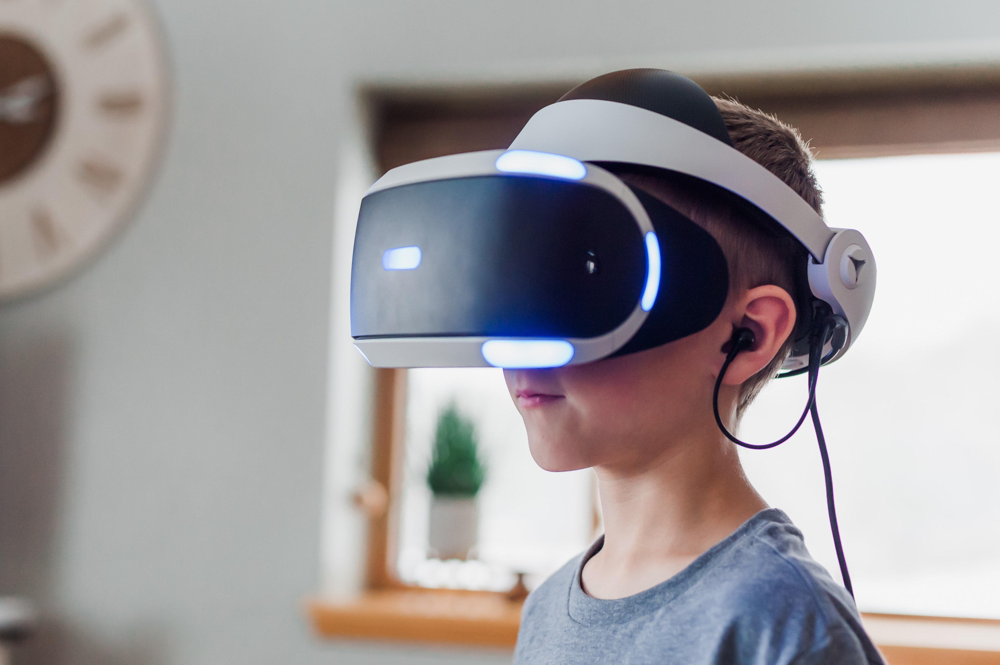

---

## Dive technology

Dive technology has captured the market’s attention. Everyone wants to know when it will be available in the market? What will be its cost? Is it going to be feasible? We are going to answer these queries and much more. Let us discuss Dive Technology in depth.
Dive technology has been the plot of a lot of films and series. We are living in times where reality is becoming stranger than fiction. Popular anime show sword art online and Netflix have made it popular among youth show-ready player one.  
With all that in mind, let us discuss whether it is workable in reality or it is just another prop for sci-fi TV shows. Let us explore whether we will buy it off a supermarket shelf in near future or not. 
Dive has been getting a lot of mainstream attention that’s a fact. Several new start-ups have come forward in the virtual reality domain. Many tech billionaires like Elon Musk have hopped on this bandwagon as well. VR and AR are trending topics on social media platforms. We can see this as a positive sign for the VR industry. This will give big corporations incentives to fund the R&D. 
It is a fact that dive technology will be the future of virtual reality. The question remains when we will have a full dive experience. Dive is a one-of-a-kind technology that’s for sure. It gives players a sense of immersion in the virtual world. We have made plenty of anime series which explore the future of dive technology in gaming. This includes the famous sword art online and overlord anime series. Both of them have the same plot where the player gets stuck in-game. Full dive technology immerses them in the virtual game and because of some technical glitch they cannot exit it. The anime balances the positive and negative sides of the Full Dive gaming experience remarkably. 
Full Dive technology makes players completely immersed in the game. It gets to a point where it gets harder to distinguish between reality and the virtual world. 

## Is virtual reality possible?

VR in the market is still a work in progress. They are far from providing a full dive experience. Full dive technology requires a brain-to-computer interface. This is the most complicated and complex challenge to solve in the development of dive technology. Human brains are highly complex and mapping every aspect of them is near impossible. 
When we say full dive, it means fully immersive virtual experience. It means creating a virtual space that is difficult to distinguish from reality. In an ideal Full Dive gaming experience, the players will control their avatar using their thoughts. Players can control their actions via thoughts. But considering the current situation of VR, this is far from reality.

## Is Dive technology the future of gaming?

With the current advancement rate in technology, full dive will be the future of gaming. The nerve gear shown in the anime series imitates the experience of smell, taste, touch, and pain not affecting the player’s body. Giving all 5 senses an illusion that you are in the virtual world is not a simple thing to do. 
It has to create an illusion that is immersive and makes you feel you are in the real world. This is the most challenging task, as the brain signals that are being transferred to the body would have to be intercepted. And the story doesn’t end there. As a result, these nerve signals have to be channeled into the machine, which creates an illusion of the virtual world. This technology is not possible for the next 20 years. Accomplishing this would require immense research and funding that is not yet being provided. 
With incremental advancements in virtual reality and augmented reality, it will be possible in the future. It is hard to predict when it will be available in the market. Therefore, modern technology and research scientists might have a breakthrough in the next couple of years or it might take a decade or more. Both of the possibilities are still on the table.  

## Technologies similar to Dive

Lets us discuss the various technologies that can be considered a primitive version of dive technology. 
Tech billionaire Elon Musk launched a startup called Neuralink. He said in his interview that interaction between humans and technology right now is very inefficient. Similarly, with the use of neuralink, people will interact with technology and the internet at a much greater speed.  
The neuralink technology has shown that it is not a marketing gimmick but an actual product. Moreover, they mapped the brain signals of pigs and predicted their body movements. This kind of technology can be the gateway for the development of future Dive technology. But most of these initiatives are in their infant stage. Right now, we are just scratching the potential of what virtual reality offers.   
Another company on the list is Newable, which developed a game called awakening. In addition, the players use their thoughts to move objects in the game. This idea is so unique that no one else has tried it before them. The game lets the players manipulate different objects just by focusing on them.

## Advancements in Virtual Reality

Virtual Reality is getting better and better as time goes on. Companies realize various applications of VR. This is good because more money is getting funneled into the development of VR technology. As of right now, the most advanced VR experience comprises handheld devices that act as hands or controllers.  
Along with the advancements in VR, neuroscience and computer science will progress further. This will increase our knowledge of the brain along with our computing power. It is important because the key to developing full dive VR is understanding how the brain functions. This is something our researchers are still mapping out, understanding the human brain can be a hard task. Brains do not execute lines of code to perform functions in an orderly manner like computers. Brains are more of a mishmash of competing signals of electricity, flowing along pathways based on our development throughout life.  

## Conclusion

So we would need a computer powerful and smart enough that can map the human brain. We will probably have something more like a ready player one film in the coming years but full dive is a much bigger hurdle to jump. Moreover, full dive VR will probably be a thing in about 10–20 years from now, depending on how much research we put into it. Although giving even a range of time that broad can be difficult because it is hard to predict where the technology will take us in the coming years. As more and more people understand the importance of technology and innovation, our dream of full dive is only a matter of time.
