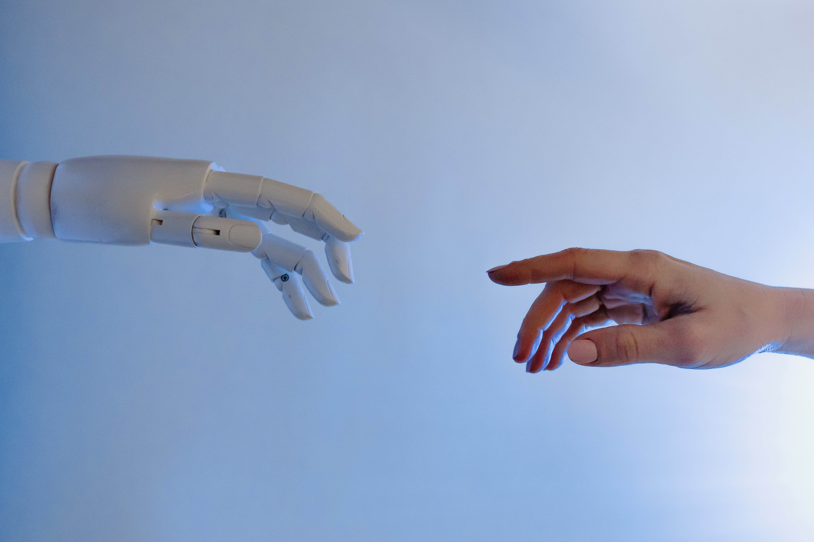

---

## Who Benefits from AI?
AI is no longer a tech of the future, it is already here. Ai dictates our news feeds on various social media apps. It is showing us ads based on our purchase and search history. Similarly, companies are using AI to ensure the maximum retention time from the users. AI is everywhere and has become a distinct part of our lives, from chatbots to virtual assistants in our phones. In short, it is going to open a new chapter for society.

## Uses of AI
Many people have been saying that AI will bring a lot of positive changes in our quality of life. We can outsource the redundant work to Ai while humans can do jobs that require creativity. Therefore, we will use Ai to do tasks that don’t require human supervision. That’s how AI will ultimately unfold.

## Supporters of AI 
We are now solving problems with machine learning and Ai that were in the realm of science fiction for the last several decades. Likewise, any time you work with technology, you need to learn to harness the benefits while minimizing the downsides.

## What about Ai applications?
- Autonomous Vehicles
We’re focusing on autonomous systems and self-driving cars. Moreover, if you look at self-driving cars, they’re going to be safer than people driving cars.

- Medical Applications
Ai is already helping us diagnose diseases better and match up drugs with people depending on their disease. So it’s going to help many people get medical treatment. Moreover, it will give them better health care than they would have access to before.

- Product recommendations
A lot of value that we are getting from machine learning, it’s happening beneath the surface. AI has been used to improve the quality of our search results and product recommendations.

- Speech and Image Recognition
There is a class of things like speech recognition and image recognition, that the performance levels of Ai are phenomenal. Similarly, Ai even performs better than humans in the fields of speech and image recognition.

- Medical Research
We used Ai in the discovery of new drugs. The biological systems are complicated to figure out. Using Ai we have been able to start the development of vaccines for TB and HIV. The data analysis and advancements in biology and machine learning to make these vaccines possible.

## Will it affect the job market?
Ai is going to progress with time. Technology has the nature of growing. We know that, 20-30 years ago, the person received the education that carried through the rest of their life. So, the present-day generation must be ready to learn and be able to adapt to the ever-changing technology. The new generation would have to learn new things throughout their lifetime.
We must provide skill development courses that make the new generation ready for the change. The change is inevitable we would have to adapt ourselves to it.
The Ai can bring more empowerment, more inclusiveness, and we should be clear-eyed about displacement. We have to be clear-eyed about unintended consequences like any other type of technology. And last, we have to set policy decisions that will help people as they go through this change.

## Will AI be a threat to the Human Kind?
The risks are significant; therefore, we need to think about AI safety from day one. Be very transparent and open about how we pursue progress there, and figure out global frameworks by which we can engage. Similarly, we have to bring people together to engage in the provocative questions, and the solutions will emerge.
Tech billionaire Elon Musk said in an interview that “I have exposure to the most groundbreaking Ai, and I think people should be concerned about it.” After that, he suggests that the Ai industry needs to be regulated proactively instead of being reactive. 
The Ai of present-day can process enormous data set and it can come up with brilliant correlations and insights. Right now we have machine learning algorithms that can solve an incredibly complex problem beyond any human intelligence. However, most people are quite optimistic that Ai is not a threat to humanity. 

## Conclusion
Big corporations are breaching our privacy and using Ai as a marketing tool. Similarly, normal people will have to be more aware of the technological advancements and gain skills that are needed in the market. This puts a lot of pressure and makes the idea of job insecurity even more prevailing. If we are not innovative and adapt to the change, machines will take our jobs. We would have to keep up with the ever-changing demands of the industry or it will leave us behind. In short, anything repetitive or done by the use of technology is going to be vulnerable to change. If you’re not adapting to change, you might have to lose your job.  
The actual risk with AI isn’t malice, but competence. A super-intelligent Ai will be extremely good at accomplishing goals and if those goals didn’t align with ours, we’re in trouble.  

